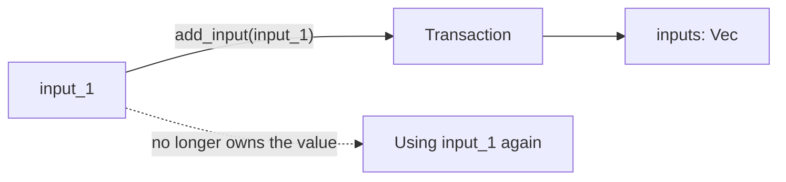
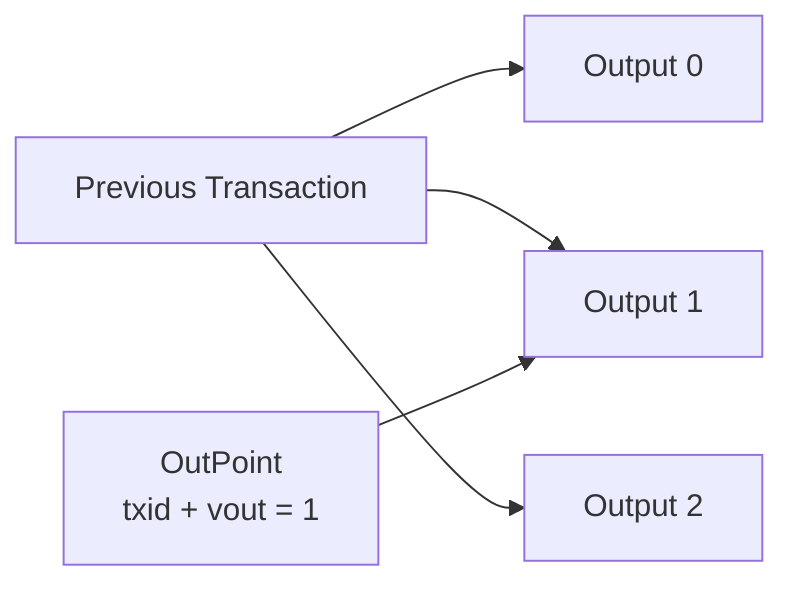
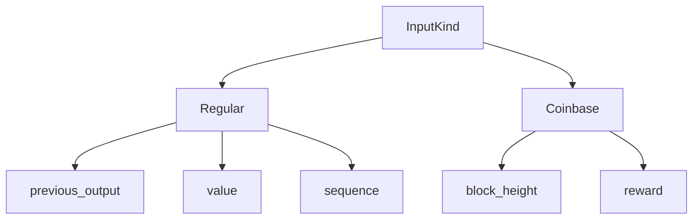

# Rust for Bitcoin 2.0 — Week 2

Build a simplified Bitcoin transaction model while practising structs, enums,
traits, ownership, borrowing, collections, and `Result`-based error handling.

The crate is intentionally incomplete. Search for `TODO` and implement each part;
do not change the public type names or function signatures.

## Recommended workflow

1. Read [ASSIGNMENT.md](ASSIGNMENT.md).
2. Complete Parts 3–5 in `transaction.rs` and `error.rs`.
3. Remove `#[ignore]` from the relevant test and run it.
4. Complete the traits and borrowing functions in Parts 6–7.
5. Build the payment example in `main.rs`.
6. Complete UTXO selection and its tests.
7. Add the remaining required tests yourself.

```bash
cargo test
cargo test -- --ignored
cargo run
cargo fmt --check
cargo clippy --all-targets --all-features -- -D warnings
```

`cargo test` checks the starter project. Ignored tests intentionally exercise
unfinished code; enable them progressively rather than leaving them ignored in the
submission.

## Written answers
### Ownership compiler error

During Part 7, I intentionally tried to use an input after moving it into the transaction:

```rust
error[E0382]: borrow of moved value: `input_1`
  --> src\main.rs:30:16
   |
11 |     let input_1 = InputKind::Regular {
   |         ------- move occurs because `input_1` has type `InputKind`, which does not implement the `Copy` trait
...
29 |     transaction.add_input(input_1);
   |                           ------- value moved here
30 |     println!("{input_1}");
   |                ^^^^^^^ value borrowed here after move
```

This happened because `add_input()` takes an InputKind by value. When I passed `input_1` to the method, ownership of that value moved into the transaction's inputs vector. Since `InputKind` does not implement Copy, the original variable could no longer be used after the move. This is Rust preventing the same owned value from being used from two places at the same time.


## Written answers
Answer in your own words. Add the ownership compiler error from Part 7 as a fenced
text block, then explain what caused it.


1. What is a Bitcoin transaction input?
#### Answer:
An input represents bitcoin being spent. For a regular transaction, it references an output from a previous transaction.

2. What is a Bitcoin transaction output?
#### Answer:
An output defines where bitcoin is sent and how much is assigned to that destination. An unspent output can later be used as an input in another transaction.

3. What is a UTXO?
#### Answer:
A ```UTXO``` is an **Unspent Transaction Output**. It is bitcoin from a previous output that has not yet been spent and is available for a new transaction.

4. What does an outpoint identify?

#### Answer:
An outpoint identifies one specific output from a previous transaction using:

- the transaction ID (`txid`)
- the output index (`vout`)


5. How is a transaction fee calculated?
#### Answer:
The fee is the difference between the total input value and the total output value.
```
fee = total inputs - total outputs
```
In the payment example:

```
120,000 sats inputs
118,000 sats outputs
--------------------
  2,000 sats fee

```
**Easy peace, truth!**

6. Why use integers rather than floating-point numbers for bitcoin amounts?
#### Answer:
Satoshis are discrete units, so integer values represent them exactly. Floating-point numbers can introduce rounding errors, which are undesirable when working with money.

7. Why does `total_input_value()` borrow `self`?
#### Answer:
Because it only needs to read the transaction's inputs. It does not modify or take ownership of the transaction.


8. Why does `add_input()` take `&mut self`?
#### Answer:
Because adding an input modifies the transaction's `inputs` vector. Rust therefore requires mutable access.

9. What happens when an input is moved into a transaction?
#### Answer:
Ownership of the input is transferred into the transaction. The original variable cannot be used afterward unless the design uses borrowing or cloning.


10. Why is `Result` preferable to `panic!` for validation failures?
#### Answer:

Validation errors are expected situations that the program should be able to handle. `Result` lets the caller decide what to do instead of stopping the whole program.


11. How do enums help model regular and coinbase inputs?
#### Answer:
Both are inputs, but they contain different information. `InputKind` lets us represent both possibilities with one type while keeping their fields separate.




12. How does the `BitcoinValue` trait reduce duplication?
#### Answer:
Different types store bitcoin values differently. The BitcoinValue trait gives them a common .value() method, so the rest of the code can work with their value without repeating type-specific logic.

## Design notes

For UTXO selection, I used a simple first-in-order strategy. The function walks
through the available UTXOs and selects them until their combined value reaches
the target.

This approach is simple and predictable, although it does not try to minimize
the number of inputs or optimize transaction fees.

The selected UTXOs are returned as references instead of clones, which keeps
ownership with the original collection and practices Rust borrowing.

## Example output

Paste the output of `cargo run` here once Part 8 is complete.
