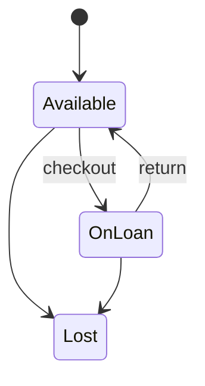
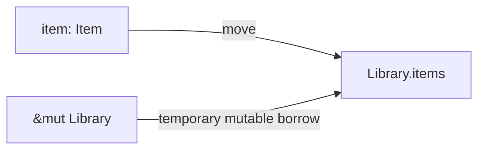
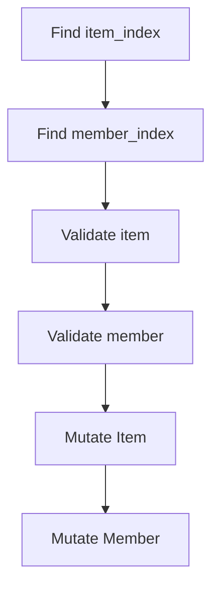
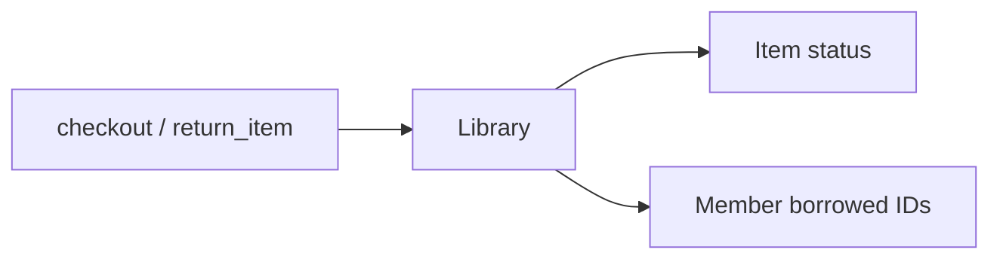
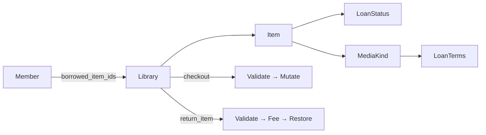

# Rust for Bitcoin 2.0 — Week 2, Session 4

Build a small lending library while practising structs, enums, traits,
ownership, borrowing, collections, and `Result`-based error handling. No
Bitcoin and no external crates — just Rust.

The crate is intentionally incomplete. Search for `TODO` and implement each
part; do not change the public type names or function signatures.

## Recommended workflow

1. Read [ASSIGNMENT.md](ASSIGNMENT.md).
2. Complete Part 2 in `error.rs`, then Part 3 in `library.rs`.
3. Remove `#[ignore]` from the relevant test and run it.
4. Complete the traits in Part 4 and the two operations in Parts 5–6.
5. Run the ownership experiments and record the errors.
6. Build the demo in `main.rs`.
7. Add the remaining required tests yourself.

```bash
cargo test
cargo test -- --ignored
cargo run
cargo fmt --check
cargo clippy --all-targets --all-features -- -D warnings
```

`cargo test` checks the starter project. Ignored tests intentionally exercise
unfinished code; enable them progressively rather than leaving them ignored in
the submission.

## Written answers

Answer in your own words. Add both ownership compiler errors from Part 7 as
fenced text blocks, then explain what caused each.

### 1. Why is `LoanStatus` an enum rather than a `bool` plus two `Option` fields?

An enum guarantees that an item has exactly one valid state: `Available`,
`OnLoan`, or `Lost`. A `bool` plus `Option` fields could represent invalid
combinations.



### 2. What does `match` force you to do when a fourth `MediaKind` is added later?

Rust requires exhaustive matching. If a new `MediaKind` is added, every
relevant `match` must handle it before the program compiles.


### 3. `Item::new` takes `String` rather than `&str`. Who owns the title afterwards?

The `String` is moved into the `Item`, so the created `Item` becomes the owner
of the title.

### 4. Why does `add_item` take `self` by `&mut` but `item` by value?

`&mut self` lets the method modify the library without taking ownership of it.
`item: Item` transfers ownership of the item into the library.



### 5. When `add_item` returns `Err`, what happened to the `Item`?

The item was moved into `add_item` and is dropped when the function returns.
An alternative API could return both the error and the original `Item`.

### 6. Why does `find_item` return `Option<&Item>` rather than `Option<Item>`?

The library keeps ownership. `Option<&Item>` lets the caller inspect an item
without moving or cloning it.

### 7. What is the lifetime `'a` in `items_by_author` actually saying?

It says that the returned `&Item` references cannot outlive the borrow of the
`Library` they came from.


### 8. Why can't `checkout` hold a `&mut Item` and a `&mut Member` from the same `Library` at once?

Keeping mutable references obtained through the same `Library` can create
overlapping mutable borrows. I avoided long-lived borrows by locating the item
and member by index, validating first, and mutating only afterwards.



### 9. Why are `Library`'s fields private?

To protect the invariant that an item's `LoanStatus` and the member's
`borrowed_item_ids` always agree.



### 10. What duplication does `late_fee_cents` remove?

It centralizes the late-fee formula. Each media type only provides its loan
duration and daily fee instead of reimplementing the calculation.

### 11. Why is `Result` preferable to `panic!` for validation failures?

Validation failures are expected and recoverable, so callers should be able to
handle them. A panic is more appropriate for an internal state that should be
impossible if the program is correct.

### 12. Which derive did you deliberately leave off a type, and why?

`Item` does not derive `Copy` or `Clone`. This makes ownership transfers
explicit and avoids accidentally duplicating library items.

## Design notes

The main design decision was to keep `Library` responsible for both sides of a
loan. A checkout only updates the item's `LoanStatus` after all validations
have passed, and then adds the item id to the member's `borrowed_item_ids`.
Returns follow the same idea in reverse.

For `checkout` and `return_item`, I used indices obtained with `position`
instead of keeping references to items and members during the entire
operation. This avoids overlapping borrows and makes it possible to validate
first and mutate afterwards.

I also implemented the optional generic `filter_items` helper using
`Fn(&Item) -> bool`. Both `items_by_author` and `available_items` reuse this
helper, which removes duplicated iteration and filtering logic.




## Errors Documentation 
### Ownership Experiment A
```text
PS C:\Users\LENOVO\Desktop\rust-for-bitcoin-2.0\rfb_labs_week_2_session_4> cargo check
    Checking rfb_labs_week_2_session_4 v0.1.0 (C:\Users\LENOVO\Desktop\rust-for-bitcoin-2.0\rfb_labs_week_2_session_4)
error[E0382]: borrow of moved value: `item`                                               
  --> src\main.rs:22:20
   |
13 |     let item = Item::new(
   |         ---- move occurs because `item` has type `Item`, which does not implement the`Copy` trait
...
20 |     library.add_item(item)?;
   |                      ---- value moved here
21 |
22 |     println!("{}", item.title);
   |                    ^^^^^^^^^^ value borrowed here after move

For more information about this error, try `rustc --explain E0382`.                       
error: could not compile `rfb_labs_week_2_session_4` (bin "rfb_labs_week_2_session_4") dueto 1 previous error
```
#### Explication Experiment A
- The error happens because `add_item` takes the `Item` by value. Calling
`library.add_item(item)` moves ownership of `item` into the library. Since
`Item` does not implement `Copy`, the original variable can no longer be used,
so accessing `item.title` afterwards is rejected by the compiler.

### Ownership Experiment  B
```text
PS C:\Users\LENOVO\Desktop\rust-for-bitcoin-2.0\rfb_labs_week_2_session_4> cargo check
    Checking rfb_labs_week_2_session_4 v0.1.0 (C:\Users\LENOVO\Desktop\rust-for-bitcoin-2.0\rfb_labs_week_2_session_4)
error[E0502]: cannot borrow `library` as mutable because it is also borrowed as immutable 
  --> src\main.rs:32:5
   |
30 |     let held_item = library.find_item(1);
   |                     ------- immutable borrow occurs here
31 |     // This need a mutable borrow of library
32 |     library.checkout(1,1,10)?;
   |     ^^^^^^^^^^^^^^^^^^^^^^^^ mutable borrow occurs here
33 |
34 |     println!("{held_item:?}");
   |                --------- immutable borrow later used here

For more information about this error, try `rustc --explain E0502`.                       
error: could not compile `rfb_labs_week_2_session_4` (bin "rfb_labs_week_2_session_4") dueto 1 previous error
```

#### Explication Experiment B
- `find_item` returns a reference into the library, so `held_item` keeps an
immutable borrow of `library` alive. `checkout` requires a mutable borrow of the
same library. Because `held_item` is used again after the checkout call, the
immutable borrow overlaps the mutable borrow, and Rust rejects the operation.

## Example output

```text
PS C:\Users\LENOVO\Desktop\rust-for-bitcoin-2.0\rfb_labs_week_2_session_4> cargo run       
    Finished `dev` profile [unoptimized + debuginfo] target(s) in 0.01s
     Running `target\debug\rfb_labs_week_2_session_4.exe`
Late fee: 100 cents
Handled error: item with id 1 is not on loan.
```