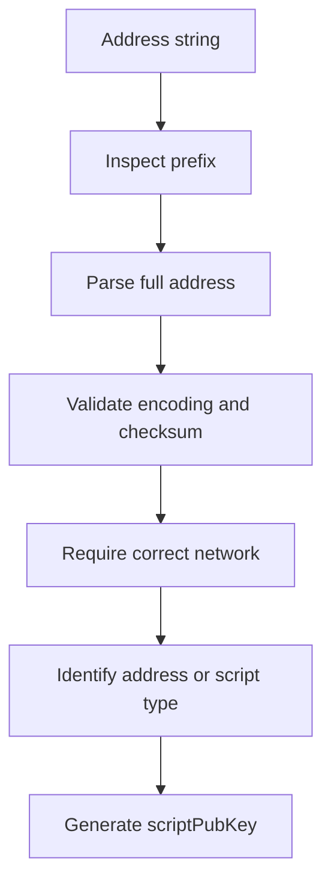

# Lab 01 — Address and network identification

## Commands used

The following command was used to run the public test suite for Lab 01:

```powershell
cargo test --test lab_01 -- --nocapture
```

The command was executed inside the Week 5 Rust project and Cargo detected the `rfb-labs-week-5` crate automatically.

## Terminal output

The Lab 01 test suite compiled successfully and all four public tests passed:

```text
Compiling rfb-labs-week-5 v0.1.0

Running tests\lab_01.rs

running 4 tests
test identifies_human_readable_prefixes ... ok
test maps_regtest_prefixes ... ok
test rejects_an_address_for_the_wrong_network ... ok
test inspects_a_network_checked_address ... ok

test result: ok. 4 passed; 0 failed; 0 ignored; 0 measured; 0 filtered out
```

The tests verified the following address formats:

* P2PKH
* P2SH
* P2WPKH
* P2TR

For Regtest, the expected prefixes were checked as:

```text
P2PKH  -> m/n
P2SH   -> 2
P2WPKH -> bcrt1q
P2TR   -> bcrt1p
```

The network-checked address test also verified that the generated `scriptPubKey` matched the `scriptPubKey` produced by `rust-bitcoin`.

The wrong-network test confirmed that a valid Regtest address is rejected when it is checked as a Bitcoin mainnet address.

## Evidence references

Evidence for this lab consists of:

* Successful execution of `cargo test --test lab_01 -- --nocapture`.
* Terminal output showing all 4 Lab 01 tests passing.
* `src/labs/lab01_addresses.rs`, containing the implementations for:

  * `identify_prefix`
  * `expected_prefix`
  * `inspect_address`
  * `script_pubkey_hex`
* `tests/lab_01.rs`, which validates address format identification, Regtest prefixes, network checking, and `scriptPubKey` generation.

Test summary:

```text
4 passed
0 failed
```

## Explanation

Inspecting the prefix of a Bitcoin address is useful for identifying its probable address format, but the prefix alone is not enough to prove that the address is valid.

For example, addresses beginning with `1` are normally P2PKH addresses on Bitcoin mainnet, while `3` is associated with P2SH. SegWit addresses use prefixes such as `bc1q`, while Taproot addresses use `bc1p`. Regtest uses prefixes such as `bcrt1q` and `bcrt1p`.

However, a string can begin with one of these prefixes and still not be a valid Bitcoin address.

Complete validation also requires parsing the full address encoding and checking its checksum. This detects corrupted or malformed addresses.

The network must also be checked explicitly. A valid address for Regtest should not be accepted when the program expects Bitcoin mainnet. In this lab, `rust-bitcoin` parses the address and `require_network` is used to enforce the intended network before the address is used.

Finally, after the address has been validated, its real script type and `scriptPubKey` can be obtained. The `scriptPubKey` is the actual locking condition encoded in a Bitcoin transaction output, while the human-readable address is a convenient representation used to construct that locking script.

Therefore, the complete process is:



Prefix inspection is therefore only the first classification step, not complete Bitcoin address validation.
