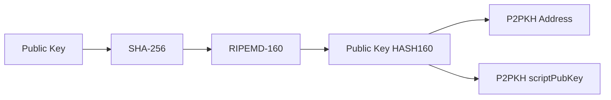
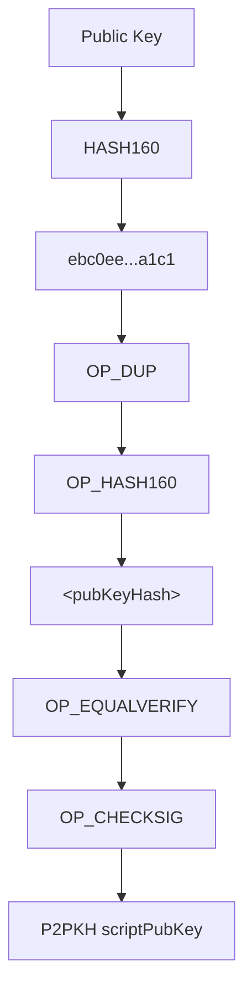
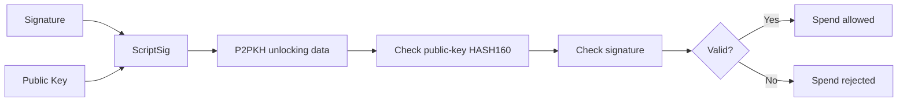
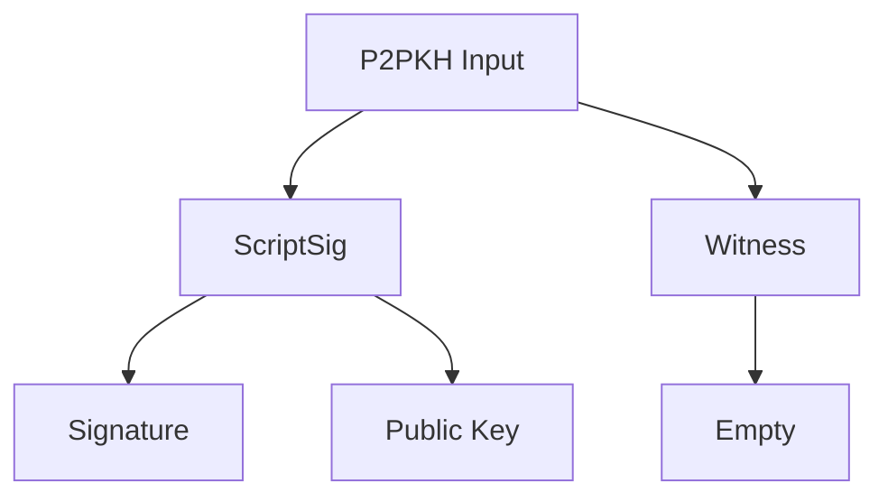

# Lab 02 — Legacy P2PKH

## Commands used

The public test suite for Lab 02 was executed with:

```powershell
cargo test --test lab_02 -- --nocapture
```

The implementation under test is located at:

```text
src/labs/lab02_p2pkh.rs
```

The test suite validates the four required functions:

* `derive_p2pkh_address`
* `build_p2pkh_script_pubkey`
* `committed_pubkey_hash`
* `p2pkh_spend_template`

## Terminal output

The deterministic public key used by the Lab 02 test fixture is:

```text
024d4b6cd1361032ca9bd2aeb9d900aa4d45d9ead80ac9423374c451a7254d0766
```

From this public key, the P2PKH commitment is:

```text
Public-key HASH160:
ebc0ee0b2ab9e8277a600c251475e22a3241a1c1
```

The corresponding Bitcoin mainnet P2PKH address is:

```text
1NVYv5jmr9JRF3usPZJQmJFJhbQhrPESTP
```

The corresponding P2PKH `scriptPubKey` is:

```text
76a914ebc0ee0b2ab9e8277a600c251475e22a3241a1c188ac
```

Its structure is:

```text
76      OP_DUP
a9      OP_HASH160
14      Push 20 bytes
ebc0ee0b2ab9e8277a600c251475e22a3241a1c1
88      OP_EQUALVERIFY
ac      OP_CHECKSIG
```

The spend-template test uses the example signature:

```text
30440220deadbeef01
```

and verifies that the legacy unlocking data is represented as:

```text
ScriptSig items:
1. 30440220deadbeef01
2. 024d4b6cd1361032ca9bd2aeb9d900aa4d45d9ead80ac9423374c451a7254d0766

Witness items:
[]
```

After running the test suite, the expected successful test summary is:

```text
running 4 tests

test derives_the_expected_p2pkh_address ... ok
test builds_the_standard_p2pkh_lock ... ok
test commits_to_hash160_of_the_public_key ... ok
test puts_unlocking_data_in_scriptsig ... ok

test result: ok. 4 passed; 0 failed
```

## Evidence references

Evidence for Lab 02 consists of:

* `src/labs/lab02_p2pkh.rs` — implementation of the four required P2PKH functions.
* `tests/lab_02.rs` — public tests validating address derivation, HASH160 commitment, the standard locking script, and the legacy unlocking structure.
* Terminal execution of:

```powershell
cargo test --test lab_02 -- --nocapture
```

* Deterministically derived P2PKH artifacts:

```text
Public key:
024d4b6cd1361032ca9bd2aeb9d900aa4d45d9ead80ac9423374c451a7254d0766

HASH160:
ebc0ee0b2ab9e8277a600c251475e22a3241a1c1

Address:
1NVYv5jmr9JRF3usPZJQmJFJhbQhrPESTP

scriptPubKey:
76a914ebc0ee0b2ab9e8277a600c251475e22a3241a1c188ac
```

## Explanation

P2PKH means **Pay to Public Key Hash**.

Instead of locking bitcoin directly to a full public key, a P2PKH output commits to the `HASH160` of that public key.

The locking process can be represented as:



For this lab, the public key:

```text
024d4b6cd1361032ca9bd2aeb9d900aa4d45d9ead80ac9423374c451a7254d0766
```

produces the commitment:

```text
ebc0ee0b2ab9e8277a600c251475e22a3241a1c1
```

That hash is inserted into the standard P2PKH locking script:

```text
OP_DUP OP_HASH160 <pubKeyHash> OP_EQUALVERIFY OP_CHECKSIG
```

Conceptually:



This script does not contain the original public key. It contains its hash.

To spend the output, the spender provides two pieces of information in the legacy `ScriptSig`:

1. a signature;
2. the public key.



During validation, Bitcoin hashes the supplied public key and checks that it matches the hash committed to by the output.

Conceptually:

```text
HASH160(provided public key)
              ==
HASH160 committed in scriptPubKey
```

If they match, `OP_CHECKSIG` then verifies that the provided signature is valid for that public key and the transaction being authorized.

This illustrates an important distinction between **key identity** and **spend authorization**.

The public-key hash identifies which public key the output expects:

```text
Public Key → HASH160 → identity commitment
```

The signature proves authorization:

```text
Private Key → Signature → authorization to spend
```

Therefore, knowing or revealing the public key alone does not authorize a spend. The spender must also produce a valid signature generated with the corresponding private key.

Because P2PKH is a legacy transaction format, the signature and public key are placed in `ScriptSig` and the witness remains empty:



This is one of the important differences that later SegWit labs will make explicit: legacy P2PKH keeps its unlocking data inside `ScriptSig`, while native SegWit moves signature-related data into the witness structure.
