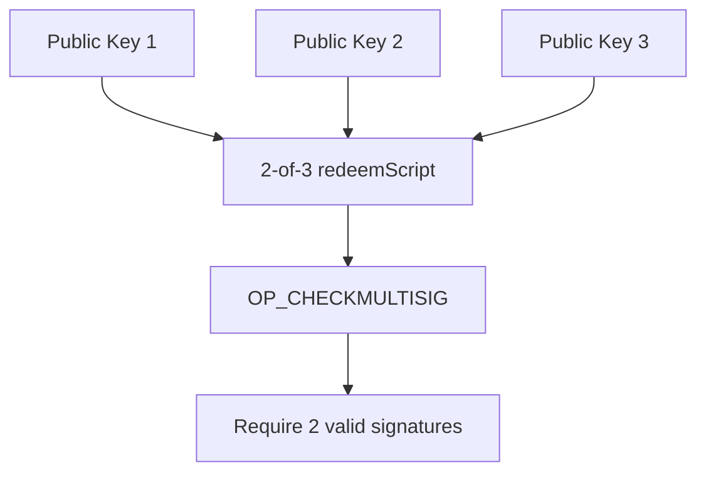
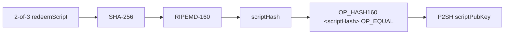
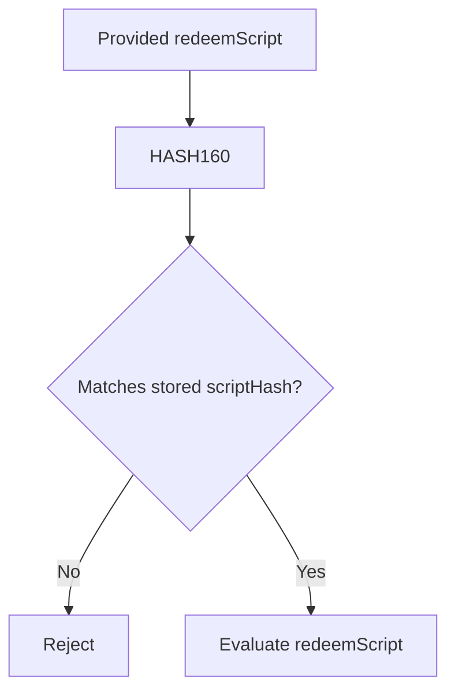
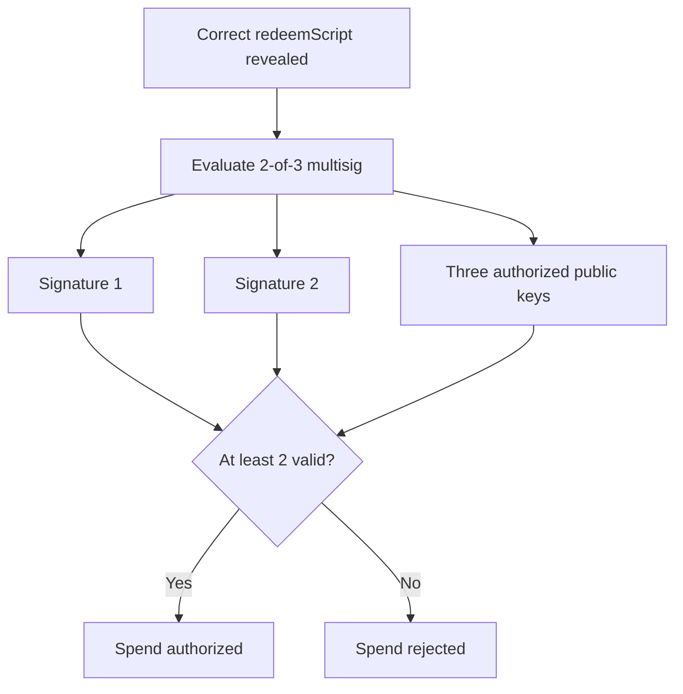
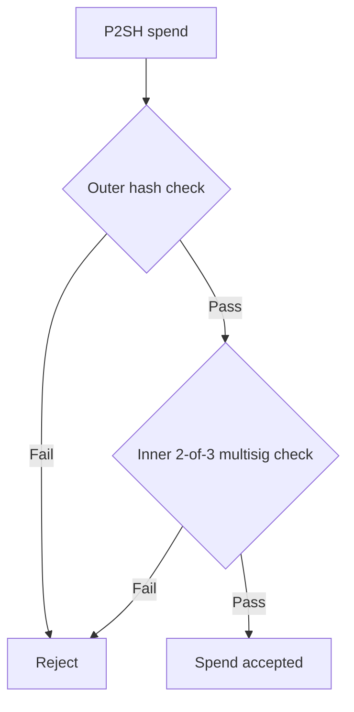

# Lab 03 — P2SH 2-of-3 multisig

## Commands used

The public test suite for Lab 03 was executed with:

```powershell
cargo test --test lab_03 -- --nocapture
```

The implementation under test is located at:

```text
src/labs/lab03_p2sh.rs
```

The test suite validates the four required functions:

* `build_2_of_3_redeem_script`
* `derive_p2sh_address`
* `build_p2sh_script_pubkey`
* `inspect_p2sh_multisig`

## Terminal output

The Lab 03 fixture uses three deterministic compressed public keys:

```text
Public key 1:
031b84c5567b126440995d3ed5aaba0565d71e1834604819ff9c17f5e9d5dd078f

Public key 2:
024d4b6cd1361032ca9bd2aeb9d900aa4d45d9ead80ac9423374c451a7254d0766

Public key 3:
02531fe6068134503d2723133227c867ac8fa6c83c537e9a44c3c5bdbdcb1fe337
```

The resulting canonical 2-of-3 multisig `redeemScript` is:

```text
5221031b84c5567b126440995d3ed5aaba0565d71e1834604819ff9c17f5e9d5dd078f21024d4b6cd1361032ca9bd2aeb9d900aa4d45d9ead80ac9423374c451a7254d07662102531fe6068134503d2723133227c867ac8fa6c83c537e9a44c3c5bdbdcb1fe33753ae
```

Its script structure is:

```text
OP_2
<pubkey 1>
<pubkey 2>
<pubkey 3>
OP_3
OP_CHECKMULTISIG
```

The HASH160 commitment to this `redeemScript` is:

```text
ae79902ae33900b679c76ced8576362e4abb15e8
```

The corresponding Regtest P2SH address is:

```text
2N99mC22Sz4sHLo6zSYkiCBmY47huZuMJbj
```

The outer P2SH `scriptPubKey` is:

```text
a914ae79902ae33900b679c76ced8576362e4abb15e887
```

Its structure is:

```text
a9      OP_HASH160
14      Push 20 bytes
ae79902ae33900b679c76ced8576362e4abb15e8
87      OP_EQUAL
```

The successful public test run should report:

```text
running 4 tests

test builds_a_two_of_three_redeem_script ... ok
test derives_the_committed_p2sh_address ... ok
test builds_the_outer_p2sh_lock ... ok
test reports_both_validation_layers ... ok

test result: ok. 4 passed; 0 failed
```

## Evidence references

Evidence for Lab 03 consists of:

* `src/labs/lab03_p2sh.rs` — implementation of the required P2SH and multisig functions.
* `tests/lab_03.rs` — public tests validating the canonical 2-of-3 `redeemScript`, Regtest P2SH address, outer locking script, and combined report.
* Terminal execution of:

```powershell
cargo test --test lab_03 -- --nocapture
```

* Deterministically derived artifacts:

```text
redeemScript:
5221031b84c5567b126440995d3ed5aaba0565d71e1834604819ff9c17f5e9d5dd078f21024d4b6cd1361032ca9bd2aeb9d900aa4d45d9ead80ac9423374c451a7254d07662102531fe6068134503d2723133227c867ac8fa6c83c537e9a44c3c5bdbdcb1fe33753ae

scriptHash:
ae79902ae33900b679c76ced8576362e4abb15e8

P2SH address:
2N99mC22Sz4sHLo6zSYkiCBmY47huZuMJbj

scriptPubKey:
a914ae79902ae33900b679c76ced8576362e4abb15e887
```

## Explanation

P2SH means **Pay to Script Hash**.

Unlike P2PKH, where the output commits to the hash of a public key, P2SH commits to the hash of an entire Bitcoin Script.

In this lab, that inner script is a 2-of-3 multisig rule:

```text
2 <pub1> <pub2> <pub3> 3 OP_CHECKMULTISIG
```

This means that three public keys are authorized, but at least two valid signatures are required to satisfy the script.



The `redeemScript` is not placed directly in the transaction output.

Instead, Bitcoin calculates:

```text
HASH160(redeemScript)
```

and places that commitment inside the outer P2SH `scriptPubKey`.



For this lab, the script hash is:

```text
ae79902ae33900b679c76ced8576362e4abb15e8
```

and the resulting outer locking script is:

```text
OP_HASH160
<ae79902ae33900b679c76ced8576362e4abb15e8>
OP_EQUAL
```

There are therefore two separate validation layers.

### Outer validation layer

The first layer checks whether the presented `redeemScript` is the same script that the output originally committed to.

Conceptually:

```text
HASH160(provided redeemScript)
              ==
scriptHash stored in scriptPubKey
```



Passing this test only proves that the correct script was revealed.

It does **not** yet prove authorization to spend the bitcoin.

### Inner validation layer

Once the hash matches, Bitcoin evaluates the revealed `redeemScript`.

In this case:

```text
2 <pub1> <pub2> <pub3> 3 OP_CHECKMULTISIG
```

The actual spending rule requires two valid signatures corresponding to the three authorized public keys.



Therefore:

```text
Correct redeemScript hash
        does not equal
Permission to spend
```

Both conditions must succeed:



This separation is the key idea behind P2SH: the output only commits to a compact hash of the spending rule, while the full rule is revealed and executed when the output is spent.
