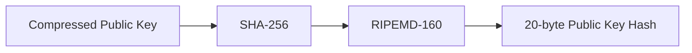
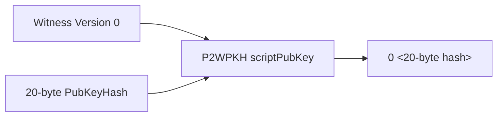
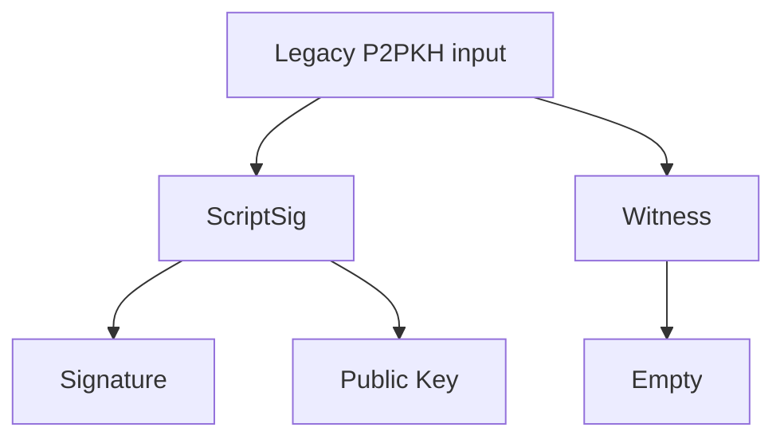
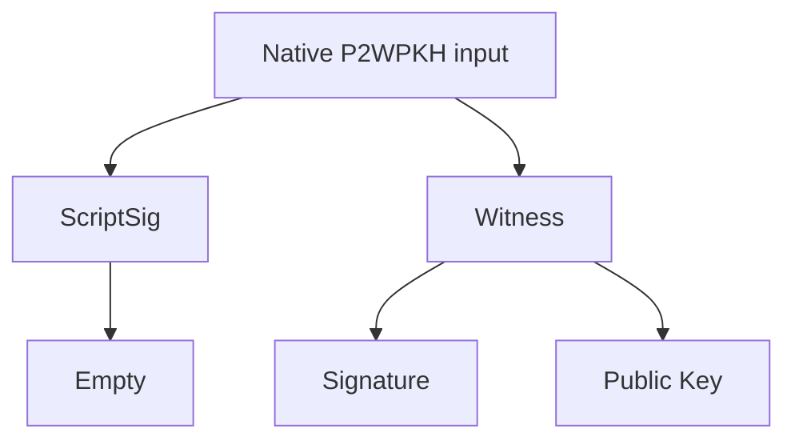
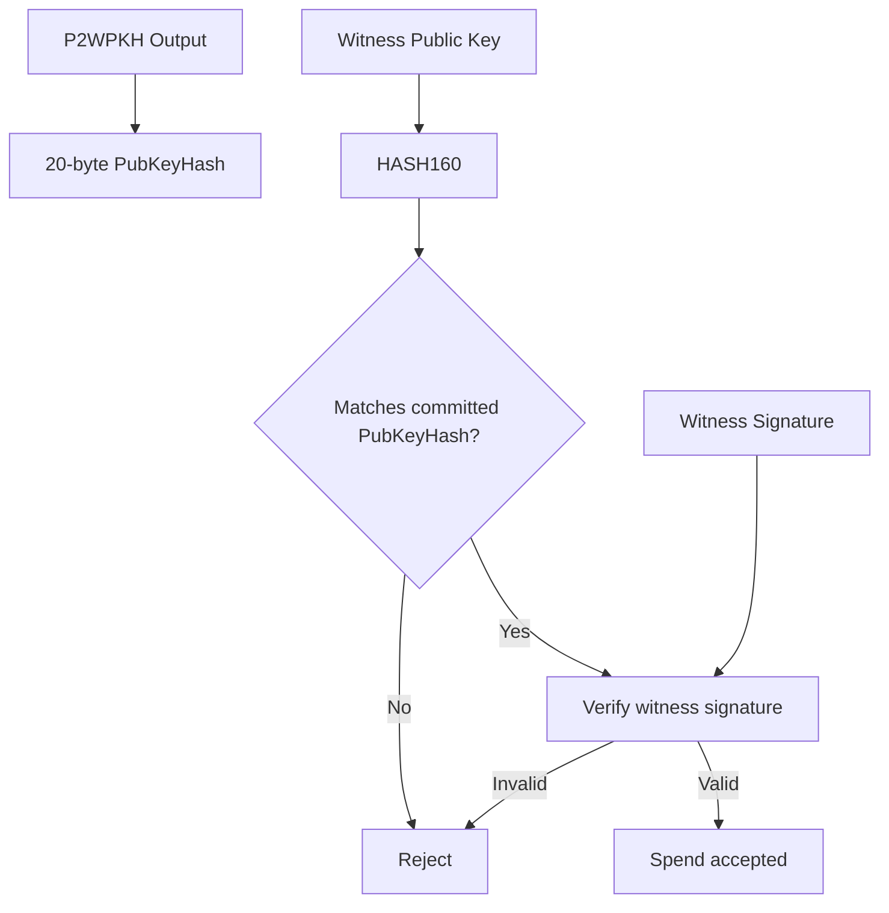
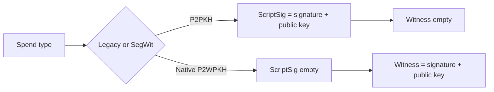

# Lab 04 — Native P2WPKH

## Commands used

The public test suite for Lab 04 was executed with:

```powershell
cargo test --test lab_04 -- --nocapture
```

The implementation under test is located at:

```text
src/labs/lab04_p2wpkh.rs
```

The test suite validates the four required functions:

* `derive_p2wpkh_address`
* `build_p2wpkh_script_pubkey`
* `witness_program`
* `native_spend_template`

## Terminal output

The Lab 04 public test uses a deterministic compressed public key derived from the fixed test secret `[4_u8; 32]`.

The resulting compressed public key is:

```text
03462779ad4aad39514614751a71085f2f10e1c7a593e4e030efb5b8721ce55b0b
```

Its HASH160 is:

```text
888dbbd7998f9f80d4f82b4f9ce6d5882f310aec
```

The corresponding native SegWit P2WPKH address on Regtest is:

```text
bcrt1q3zxmh4ue370cp48c9d8eeek43qhnzzhvquj2zm
```

The P2WPKH witness program is:

```text
Witness version:
0

Program:
888dbbd7998f9f80d4f82b4f9ce6d5882f310aec

Program length:
20 bytes
```

The corresponding `scriptPubKey` is:

```text
0014888dbbd7998f9f80d4f82b4f9ce6d5882f310aec
```

Its structure is:

```text
00    Witness version 0
14    Push 20 bytes
888dbbd7998f9f80d4f82b4f9ce6d5882f310aec
```

For the native P2WPKH spend template, the public test uses the example signature:

```text
30440220cafebabe01
```

The resulting unlocking structure is:

```text
ScriptSig:
(empty)

Witness item 0:
30440220cafebabe01

Witness item 1:
03462779ad4aad39514614751a71085f2f10e1c7a593e4e030efb5b8721ce55b0b
```

The successful public test run should report:

```text
running 4 tests

test derives_a_native_regtest_address ... ok
test builds_a_version_zero_witness_lock ... ok
test reports_a_twenty_byte_program ... ok
test leaves_scriptsig_empty_and_uses_witness ... ok

test result: ok. 4 passed; 0 failed
```

## Evidence references

Evidence for Lab 04 consists of:

* `src/labs/lab04_p2wpkh.rs` — implementation of native P2WPKH address generation, witness program construction, inspection, and spend template.
* `tests/lab_04.rs` — public tests validating the Regtest address, version-0 witness program, 20-byte program length, empty `ScriptSig`, and witness items.
* Terminal execution of:

```powershell
cargo test --test lab_04 -- --nocapture
```

* Deterministically derived artifacts:

```text
Public key:
03462779ad4aad39514614751a71085f2f10e1c7a593e4e030efb5b8721ce55b0b

HASH160 / witness program:
888dbbd7998f9f80d4f82b4f9ce6d5882f310aec

Regtest P2WPKH address:
bcrt1q3zxmh4ue370cp48c9d8eeek43qhnzzhvquj2zm

scriptPubKey:
0014888dbbd7998f9f80d4f82b4f9ce6d5882f310aec

ScriptSig:
empty

Witness:
[
  "30440220cafebabe01",
  "03462779ad4aad39514614751a71085f2f10e1c7a593e4e030efb5b8721ce55b0b"
]
```

## Explanation

P2WPKH means **Pay to Witness Public Key Hash**.

Like legacy P2PKH, it ultimately commits to the HASH160 of a public key. The important difference is how the spending condition and unlocking data are represented.

The public key is first hashed:



That 20-byte hash becomes a SegWit witness program.

For P2WPKH, the witness version is `0` and the program is exactly 20 bytes:



Serialized as bytes, the script begins with:

```text
00 14
```

where:

```text
00 = witness version 0
14 = hexadecimal 0x14 = 20 bytes
```

The full locking script in this lab is therefore:

```text
0014888dbbd7998f9f80d4f82b4f9ce6d5882f310aec
```

### Why is ScriptSig empty?

Native SegWit changes where the unlocking data is stored.

With legacy P2PKH, the signature and public key are stored in `ScriptSig`:



Native P2WPKH does the opposite:



Therefore, for a native P2WPKH spend:

```text
ScriptSig = empty
Witness   = [signature, public key]
```

The `ScriptSig` is empty because there is no legacy redeem script or unlocking script that needs to be placed there. The output already identifies itself as a native SegWit witness program.

The validator uses the witness data to prove that the spender controls the correct key.

Conceptually:



This preserves the same basic authorization model as P2PKH:

```text
Correct public key
+
Valid signature
=
Authorized spend
```

but moves the signature-related unlocking data from the legacy `ScriptSig` into the SegWit witness structure.

The main distinction can therefore be summarized as:



Native P2WPKH is therefore not changing who is authorized to spend the output; it changes how the locking condition and unlocking data are encoded within the Bitcoin transaction.
