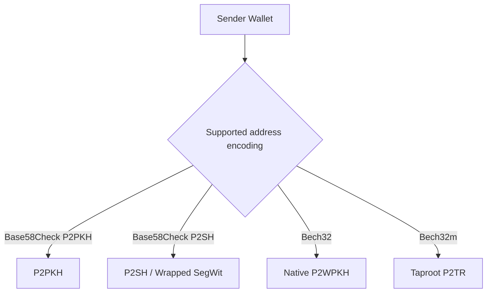
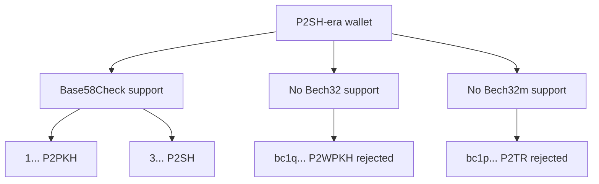
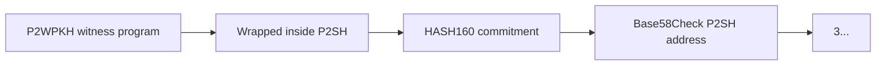
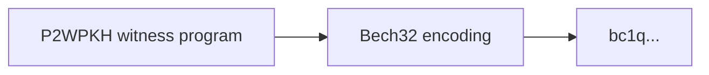
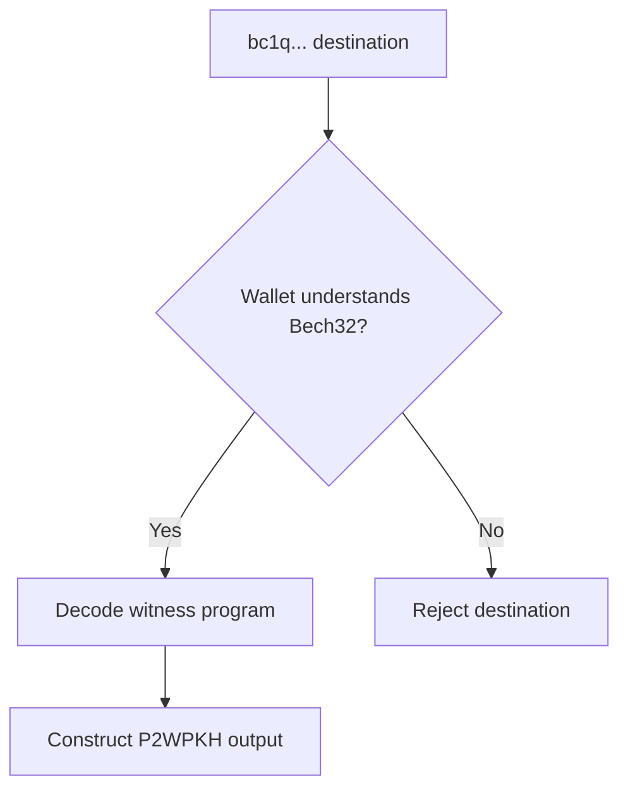
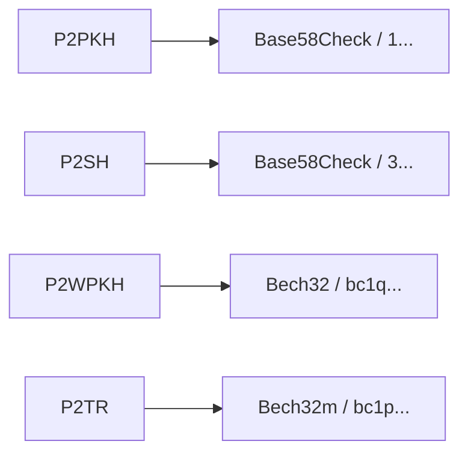
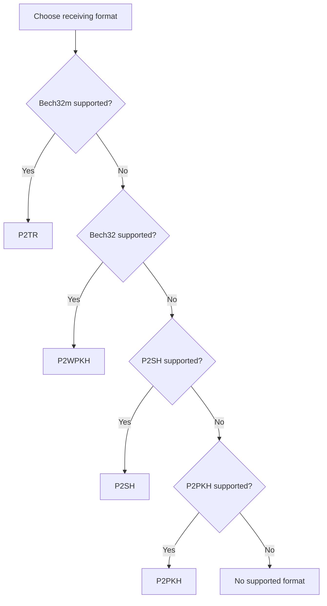
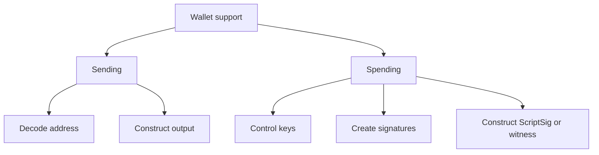

# Lab 05 — Address compatibility map

## Commands used

The public test suite for Lab 05 was executed with:

```powershell
cargo test --test lab_05 -- --nocapture
```

The implementation under test is located at:

```text
src/labs/lab05_compatibility.rs
```

The public tests validate the following functions:

* `can_send_to`
* `compatibility_report`
* `best_supported_format`
* `required_encoding`

## Terminal output

The test fixture models a wallet with the following sender capabilities:

```text
base58_p2pkh: true
base58_p2sh:  true
bech32:       false
bech32m:      false
```

This produces the following compatibility report:

```text
P2PKH:        true
P2SH-P2WPKH:  true
P2WPKH:       false
P2TR:         false
```

The wallet can therefore send to:

```text
P2PKH          -> supported
P2SH-P2WPKH    -> supported
P2WPKH         -> not supported
P2TR           -> not supported
```

The required address encodings are:

```text
P2PKH  -> Base58Check
P2SH   -> Base58Check
P2WPKH -> Bech32
P2TR   -> Bech32m
```

The preferred receiving format also changes as the wallet gains support for newer encodings:

```text
P2SH-era capabilities
    -> P2SH

+ Bech32 support
    -> P2WPKH

+ Bech32m support
    -> P2TR
```

The successful public test suite should report:

```text
running 4 tests

test older_p2sh_wallet_accepts_wrapped_but_not_native ... ok
test builds_the_four_format_map ... ok
test selects_the_most_modern_supported_format ... ok
test names_the_required_human_encoding ... ok

test result: ok. 4 passed; 0 failed
```

## Evidence references

Evidence for Lab 05 consists of:

* `src/labs/lab05_compatibility.rs` — implementation of sender compatibility logic.
* `tests/lab_05.rs` — public tests validating support for legacy, wrapped SegWit, native SegWit, and Taproot address formats.
* Terminal execution of:

```powershell
cargo test --test lab_05 -- --nocapture
```

* The resulting compatibility map:

```text
Address format       Encoding        Supported
------------------------------------------------
P2PKH                Base58Check        yes
P2SH-P2WPKH          Base58Check        yes
P2WPKH               Bech32             no
P2TR                 Bech32m            no
```

* Best-supported-format progression:

```text
Base58 P2SH only  -> P2SH
Bech32 enabled    -> P2WPKH
Bech32m enabled   -> P2TR
```

## Explanation

Bitcoin has multiple address generations, and not every wallet understands every address encoding.

A sender must first be able to decode the destination address and understand how to construct the corresponding transaction output.

The compatibility relationship used in this lab is:



A P2SH-era wallet may understand Base58Check addresses but predate support for Bech32.

This means that it can recognize addresses such as:

```text
1...
3...
```

but may not understand:

```text
bc1q...
bc1p...
```

The compatibility map is therefore:



### Why can it accept `3...` wrapped SegWit?

Wrapped SegWit uses a SegWit spending condition inside P2SH.

Conceptually:



From the sender's perspective, the destination is still a P2SH address encoded using Base58Check.

Therefore, an older wallet with P2SH support can construct a payment to the `3...` address even if it does not understand native Bech32 addresses.

The sender does not need to understand all of the script that will eventually be used to spend that output. It only needs enough support to decode the destination and build the correct P2SH transaction output.

### Why can the same wallet reject `bc1q...`?

Native P2WPKH does not use the P2SH compatibility layer.

Instead, the witness program is encoded directly using Bech32:



A wallet without Bech32 support may therefore reject the address before it even attempts to build the transaction.



The same progression applies to Taproot, which uses Bech32m instead of Bech32.



### Choosing the best supported format

The lab prefers the most modern format supported by the sender:



This produces the preference order:

```text
P2TR
  ↓
P2WPKH
  ↓
P2SH
  ↓
P2PKH
```

### Sending support is not the same as spending support

This lab specifically models whether a sender can understand an address format and construct a payment to it.

That is different from being able to spend an output of that type later.



A wallet may therefore be able to send bitcoin to a particular destination without implementing all the functionality necessary to later spend an output of the same type.

The central lesson of this lab is that Bitcoin address compatibility depends not only on the spending script itself, but also on whether the sender understands the human-readable encoding used by that address generation.
