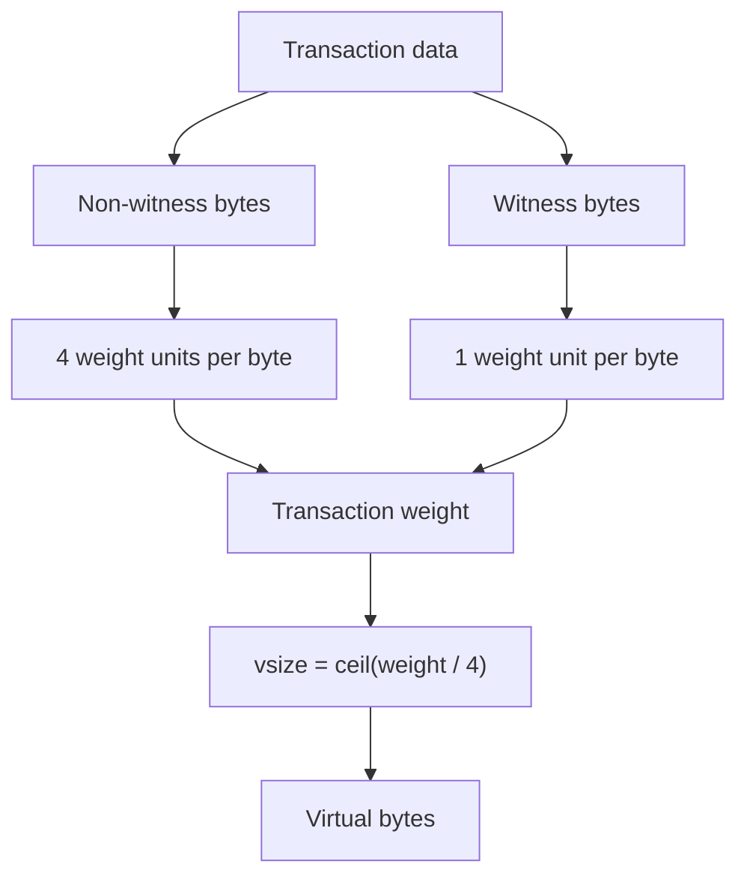
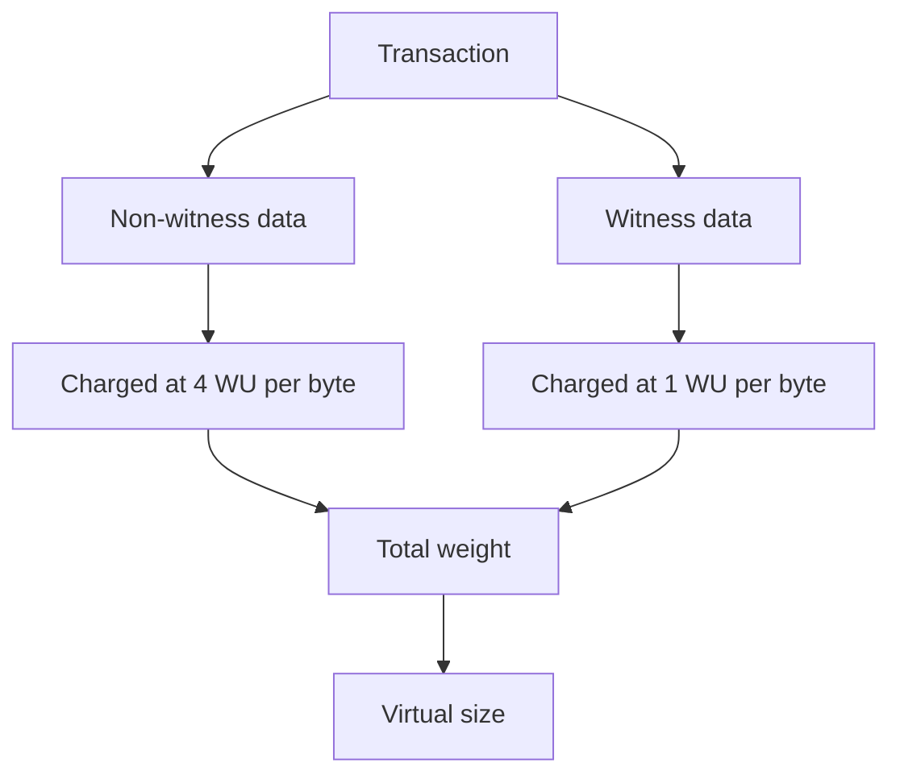
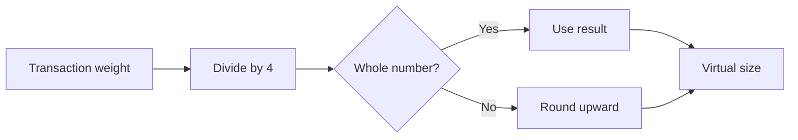
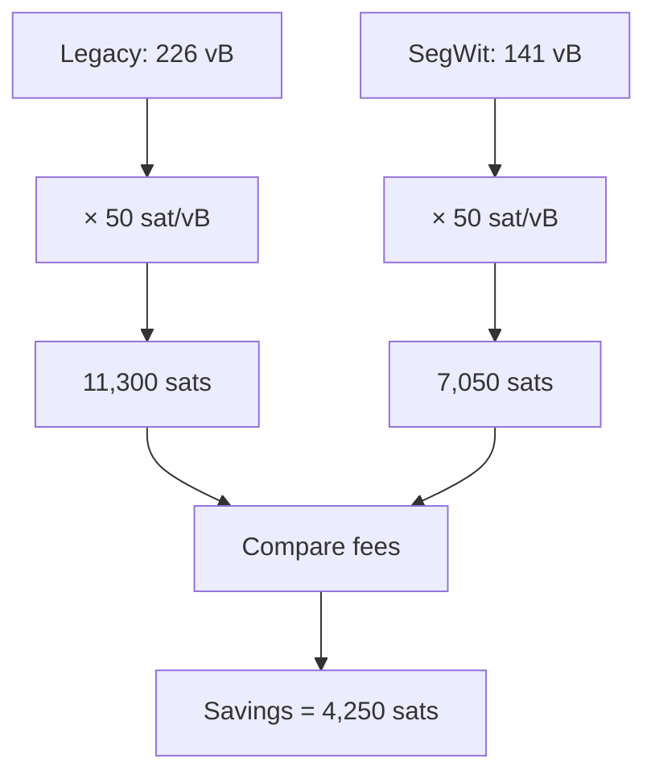
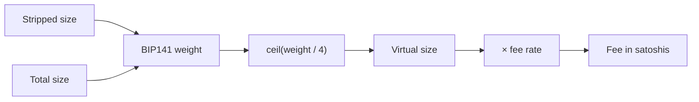

# Lab 06 — Weight, virtual size, and fees

## Commands used

The public test suite for Lab 06 was executed with:

```powershell
cargo test --test lab_06 -- --nocapture
```

The implementation under test is located at:

```text
src/labs/lab06_weight_fees.rs
```

The public tests validate the following functions:

* `transaction_weight`
* `virtual_size`
* `fee_sats`
* `compare_fees`

## Terminal output

The first test calculates BIP141 transaction weight from:

```text
stripped size = 100 bytes
total size    = 200 bytes
```

Using:

```text
weight = stripped_size × 3 + total_size
```

the result is:

```text
weight = 100 × 3 + 200
weight = 500 WU
```

The implementation also rejects an impossible size relationship:

```text
stripped size = 201
total size    = 200

Result:
error
```

because the stripped transaction cannot be larger than the total serialized transaction.

### Virtual size

Virtual size is calculated with:

```text
vsize = ceil(weight / 4)
```

The public tests verify:

```text
564 WU -> 141 vB
565 WU -> 142 vB
```

The second value demonstrates that virtual size must be rounded upward whenever the weight is not divisible exactly by four.

### Fee calculation

For:

```text
vsize    = 141 vB
feerate  = 50 sat/vB
```

the fee is:

```text
141 × 50 = 7,050 sats
```

The implementation also safely rejects arithmetic overflow.

For example:

```text
u64::MAX × 2
```

cannot be represented by a `u64`, so the function returns an error instead of overflowing.

### Legacy vs native SegWit comparison

The class comparison uses:

```text
Legacy transaction:
226 vB

Native SegWit transaction:
141 vB

Feerate:
50 sat/vB
```

Legacy fee:

```text
226 × 50
= 11,300 sats
```

Native SegWit fee:

```text
141 × 50
= 7,050 sats
```

Savings:

```text
11,300 - 7,050
= 4,250 sats
```

Therefore:

```text
Legacy vsize:       226 vB
SegWit vsize:       141 vB

Legacy fee:      11,300 sats
SegWit fee:       7,050 sats

Savings:           4,250 sats
```

The successful public test suite reports:

```text
running 4 tests

test calculates_bip141_weight ... ok
test rounds_weight_up_to_virtual_bytes ... ok
test calculates_fee_from_feerate ... ok
test reproduces_the_class_fee_comparison ... ok

test result: ok. 4 passed; 0 failed
```

## Evidence references

Evidence for Lab 06 consists of:

* `src/labs/lab06_weight_fees.rs` — implementation of transaction weight, virtual size, fee calculation, and legacy/SegWit fee comparison.
* `tests/lab_06.rs` — public tests for BIP141 weight accounting, vsize rounding, overflow-safe fee calculation, and the class fee comparison.
* Terminal execution of:

```powershell
cargo test --test lab_06 -- --nocapture
```

* Verified numerical results:

```text
Weight example:
stripped_size = 100
total_size    = 200
weight        = 500 WU

Virtual-size examples:
564 WU -> 141 vB
565 WU -> 142 vB

Legacy:
226 vB × 50 sat/vB = 11,300 sats

Native SegWit:
141 vB × 50 sat/vB = 7,050 sats

Savings:
4,250 sats
```

## Explanation

Bitcoin transaction fees are generally discussed in terms of virtual bytes rather than simply using the raw serialized byte size.

With SegWit, Bitcoin distinguishes between the part of the transaction that exists without witness data and the complete serialized transaction that includes the witness.

The BIP141 weight formula used in this lab is:

```text
weight = stripped_size × 3 + total_size
```

This can also be understood as:

```text
weight =
4 × non-witness bytes
+
1 × witness bytes
```

because:

```text
total_size = stripped_size + witness_size
```

Therefore:

```text
3 × stripped_size + total_size

= 3 × stripped_size
  + stripped_size
  + witness_size

= 4 × stripped_size
  + witness_size
```

This is the key idea behind SegWit weight accounting.



### Weight is not the same as bytes

A transaction may contain a certain number of physical serialized bytes, but BIP141 assigns different weight contributions depending on where those bytes appear.

A non-witness byte contributes:

```text
4 weight units
```

while a witness byte contributes:

```text
1 weight unit
```

Therefore, moving signature-related data into the witness changes the transaction's effective virtual size.

### Why this is not a flat SegWit discount

It would be inaccurate to say that every SegWit transaction simply receives a fixed percentage discount.

The savings depend on the actual structure of the transaction and on how many bytes are witness data versus non-witness data.



A transaction with more data moved into the witness can have a lower virtual size than a comparable legacy transaction, but the exact reduction depends on the transaction itself.

Therefore:

```text
SegWit
does NOT mean
fixed percentage fee discount
```

Instead:

```text
SegWit
means
different weight accounting for witness data
```

### From weight to virtual size

Bitcoin converts weight units into virtual bytes using:

```text
vsize = ceil(weight / 4)
```

For example:

```text
564 / 4 = 141
```

so:

```text
564 WU -> 141 vB
```

But:

```text
565 / 4 = 141.25
```

and Bitcoin rounds upward:

```text
565 WU -> 142 vB
```



### From virtual size to transaction fee

Once virtual size is known, the transaction fee can be calculated from a fee rate:

```text
fee = vsize × feerate
```

where the fee rate is expressed in:

```text
sat/vB
```

For the native SegWit example:

```text
141 vB × 50 sat/vB
= 7,050 sats
```

For the legacy transaction:

```text
226 vB × 50 sat/vB
= 11,300 sats
```

The difference is:

```text
4,250 sats
```



The important point is that both transactions use the **same fee rate**.

The lower SegWit fee in this example comes from its smaller virtual size:

```text
same sat/vB
+
smaller vsize
=
smaller total fee
```

### Complete fee-calculation flow

The complete relationship implemented in this lab is:



This lab therefore connects transaction serialization directly to fee economics:

```text
transaction structure
        ↓
weight
        ↓
virtual size
        ↓
fee rate
        ↓
transaction fee
```

SegWit can reduce the virtual size of transactions because witness bytes contribute less weight, but the reduction is a consequence of BIP141's weight accounting rather than a universal flat discount.
