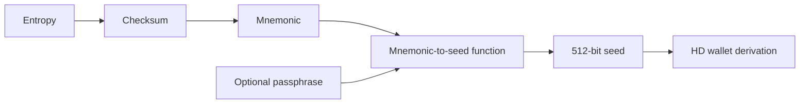
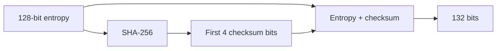
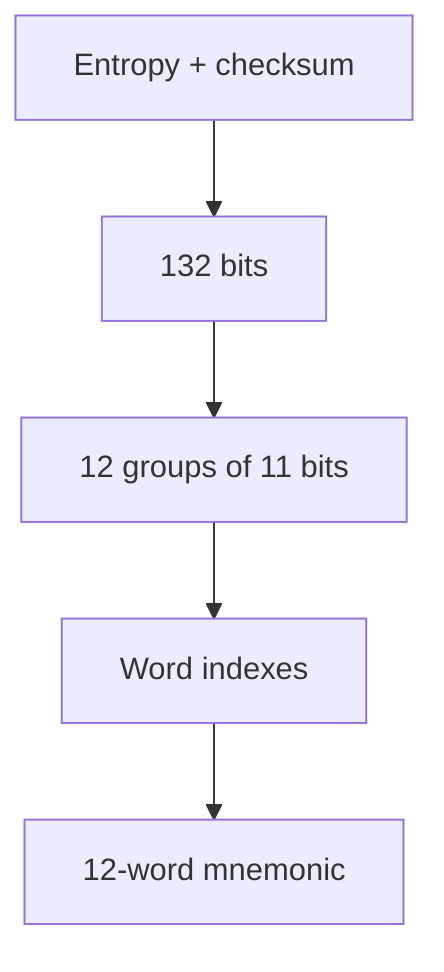
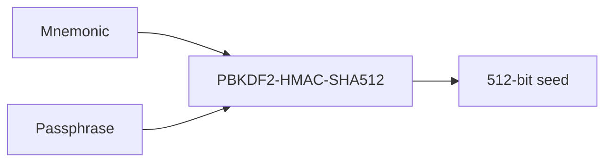
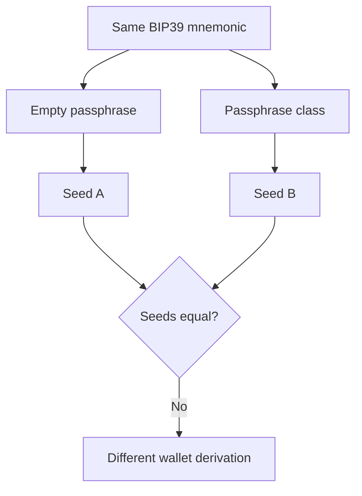
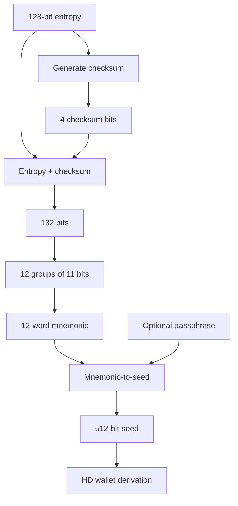

# Lab 07 — BIP39 mnemonic and seed

## Commands used

The public Lab 07 test suite was executed with:

```powershell
cargo test --test lab_07 -- --nocapture
```

The implementation under test is located at:

```text
src/labs/lab07_bip39.rs
```

Only the public BIP39 test mnemonic was used:

```text
abandon abandon abandon abandon abandon abandon abandon abandon abandon abandon abandon about
```

No real wallet mnemonic, private key, production seed, or personal passphrase was used.

The public tests validate:

* BIP39 mnemonic validation;
* entropy and checksum structure;
* rejection of an invalid checksum;
* deterministic 512-bit seed generation;
* the effect of an optional passphrase;
* recognition of the public classroom test mnemonic.

## Terminal output

The valid public test mnemonic contains:

```text
Word count:     12
Entropy bits:   128
Checksum bits:  4
```

This follows the BIP39 relationship:

```text
CS = ENT / 32

CS = 128 / 32
CS = 4 bits
```

The complete encoded mnemonic therefore represents:

```text
128 entropy bits
+
4 checksum bits
=
132 bits
```

These 132 bits are divided into twelve groups of 11 bits:

```text
132 / 11 = 12 words
```

The test suite also checks an invalid mnemonic:

```text
abandon abandon abandon abandon abandon abandon abandon abandon abandon abandon abandon abandon
```

Although all twelve words belong to the BIP39 English word list, the checksum is invalid, so the mnemonic must be rejected.

### Published BIP39 seed vector

For the public mnemonic:

```text
abandon abandon abandon abandon abandon abandon abandon abandon abandon abandon abandon about
```

with the public test passphrase:

```text
TREZOR
```

the expected 512-bit seed is:

```text
c55257c360c07c72029aebc1b53c05ed0362ada38ead3e3e9efa3708e534955
31f09a6987599d18264c1e1c92f2cf141630c7a3c4ab7c81b2f001698e7463b04
```

The seed contains:

```text
64 bytes
=
512 bits
=
128 hexadecimal characters
```

### Passphrase comparison

The tests also compare the same mnemonic with:

```text
Passphrase A:
(empty)

Passphrase B:
class
```

The resulting seeds must be different:

```text
same mnemonic
+
different passphrase
=
different seed
```

The public test verifies:

```text
seeds_differ = true
```

The expected successful test result is:

```text
running 4 tests

test validates_entropy_and_checksum_structure ... ok
test rejects_an_invalid_checksum ... ok
test matches_the_published_bip39_seed_vector ... ok
test passphrase_selects_a_different_wallet ... ok

test result: ok. 4 passed; 0 failed
```

## Evidence references

Evidence for Lab 07 consists of:

* `src/labs/lab07_bip39.rs` — implementation of mnemonic validation, seed derivation, passphrase comparison, and public-test mnemonic recognition.
* `tests/lab_07.rs` — public tests using the safe BIP39 classroom mnemonic.
* Terminal execution of:

```powershell
cargo test --test lab_07 -- --nocapture
```

* Safe public test data:

```text
Mnemonic:
abandon abandon abandon abandon abandon abandon abandon abandon abandon abandon abandon about

Words:
12

Entropy:
128 bits

Checksum:
4 bits

Test passphrases:
TREZOR
class
```

* Published deterministic seed vector used by the public test:

```text
c55257c360c07c72029aebc1b53c05ed0362ada38ead3e3e9efa3708e534955
31f09a6987599d18264c1e1c92f2cf141630c7a3c4ab7c81b2f001698e7463b04
```

No private wallet information is included in this evidence.

## Explanation

BIP39 defines a process for representing cryptographic entropy as a sequence of human-readable recovery words and for deriving a deterministic seed from those words.

Several different concepts are involved:



### Entropy

Entropy is the original random information from which the mnemonic is constructed.

For the 12-word mnemonic used in this lab:

```text
ENT = 128 bits
```

The entropy is the underlying randomness. It is not itself the list of words and is not the final wallet seed.


### Checksum

BIP39 adds checksum bits derived from the entropy.

The checksum length is:

```text
CS = ENT / 32
```

For 128 bits of entropy:

```text
CS = 128 / 32
CS = 4 bits
```

Therefore:

```text
128 entropy bits
+
4 checksum bits
=
132 bits
```



The checksum allows BIP39 software to detect many invalid mnemonic sequences.

This is why:

```text
abandon x11 + about
```

is valid, while:

```text
abandon x12
```

is rejected even though every individual word is part of the BIP39 word list.

A mnemonic is therefore not valid merely because all its words exist in the dictionary.

### Mnemonic

The entropy plus checksum is divided into 11-bit groups.

For this example:

```text
132 bits / 11
=
12 groups
```

Each 11-bit value selects one word from the 2048-word BIP39 English list.



The mnemonic is therefore a human-readable representation derived from entropy and checksum.

### Seed

The mnemonic itself is not the final seed used by the hierarchical deterministic wallet.

Instead, BIP39 applies its mnemonic-to-seed derivation process using the mnemonic and an optional passphrase.



The result is:

```text
512 bits
=
64 bytes
```

That seed can then become the input to hierarchical deterministic key derivation.


BIP32 derivation is handled in the following laboratory rather than in BIP39 itself.

### Passphrase

The BIP39 passphrase is an additional input to seed derivation.

It is not part of the mnemonic words.

For example:

```text
Mnemonic:
abandon abandon ... about

Passphrase:
(empty)
```

produces one seed.

The same mnemonic with:

```text
Passphrase:
class
```

produces another seed.



This means:

```text
same recovery words
+
different passphrase
=
different wallet seed
```

A passphrase is therefore not simply a password that unlocks an existing seed. It participates directly in generating the seed.

### Complete BIP39 flow

The complete conceptual process demonstrated by this lab is:



The important distinctions are therefore:

```text
Entropy
= original random information

Checksum
= validation bits derived from entropy

Mnemonic
= human-readable representation of entropy + checksum

Passphrase
= optional additional input to seed derivation

Seed
= 512-bit deterministic result used for subsequent HD wallet derivation
```

For security, this lab uses only the published classroom mnemonic and public test passphrases. Real recovery words, seeds, private keys, or wallet passphrases should never be placed in source code, terminal evidence, screenshots, Git commits, or submission files.
