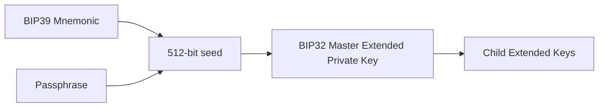
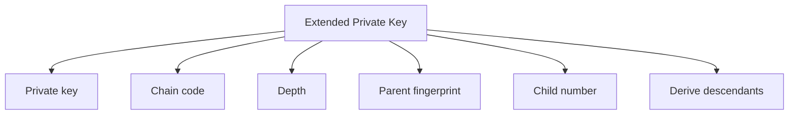
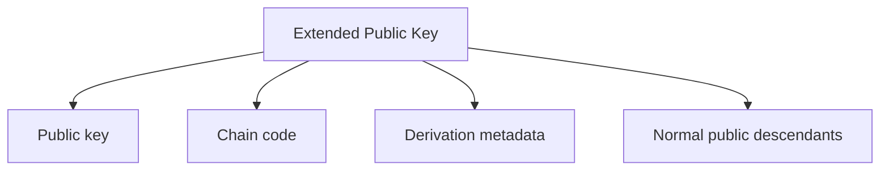
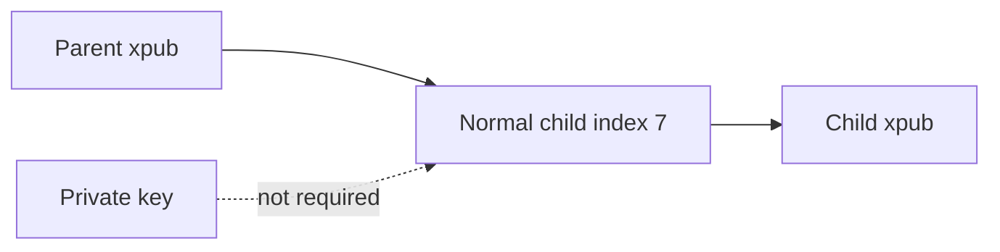
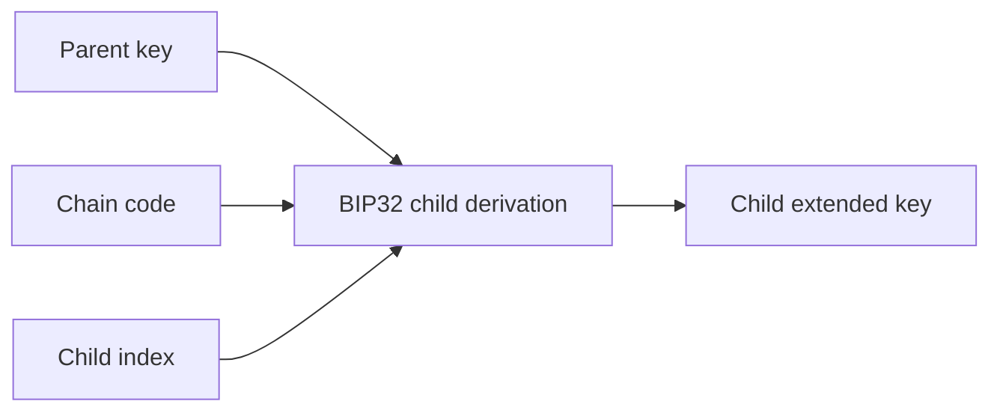
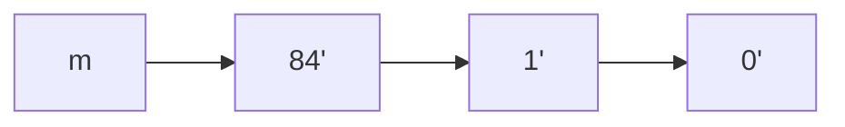
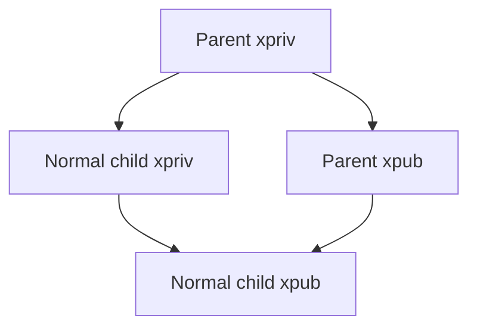
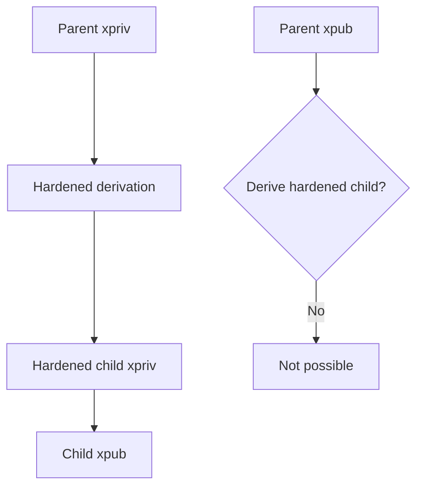
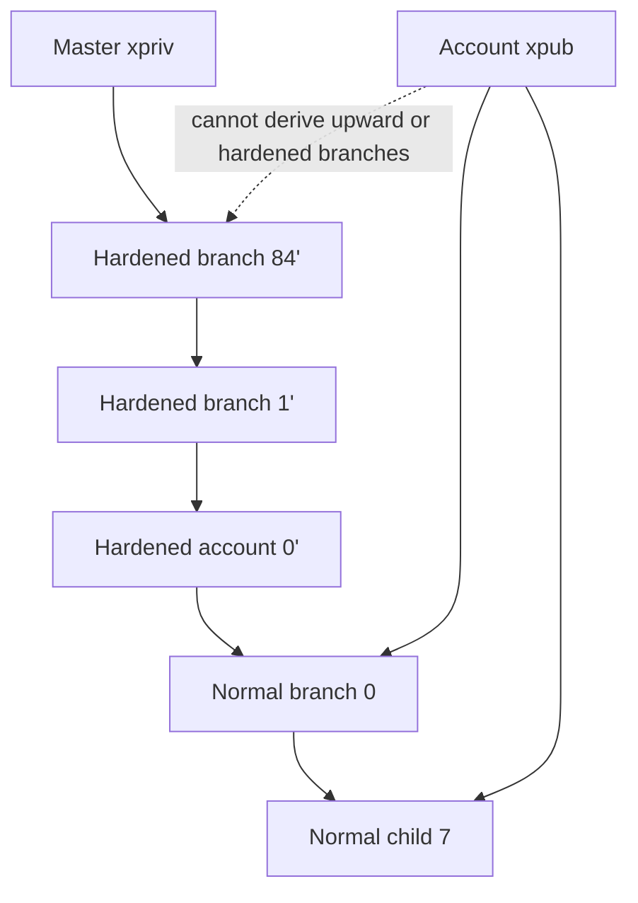
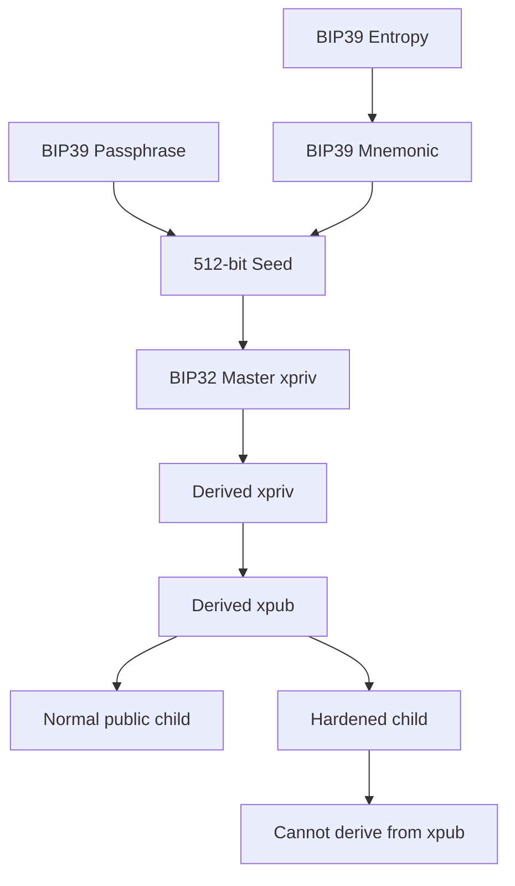

# Lab 08 — BIP32 extended keys

## Commands used

The Lab 08 public test suite is executed with:

```powershell
cargo test --test lab_08 -- --nocapture
```

The implementation under test is located at:

```text
src/labs/lab08_bip32.rs
```

Only disposable public classroom test data is used:

```text
Mnemonic:
abandon abandon abandon abandon abandon abandon abandon abandon abandon abandon abandon about

Passphrase:
(empty)

Network:
Regtest
```

No real wallet mnemonic, seed, xpriv, private key, or production wallet information is used.

The public tests validate:

* creation of a deterministic BIP32 master extended private key;
* derivation of matching extended private/public keys;
* non-hardened child derivation directly from an xpub;
* detection of hardened derivation steps;
* rejection of invalid derivation paths.

## Terminal output

The Regtest master extended private key uses the test-family prefix:

```text
Master extended private key:
tprv...[REDACTED]
```

The public test verifies that deriving the master key twice from the same inputs gives the same result:

```text
same mnemonic
+
same passphrase
+
same network
=
same master xpriv
```

### Extended-key derivation

The test derives:

```text
m/84'/1'/0'
```

The resulting extended keys use Regtest/testnet-family prefixes:

```text
Derivation path:
m/84'/1'/0'

Derived xpriv:
tprv...[REDACTED]

Derived xpub:
tpub...[REDACTED]
```

The complete private extended key is intentionally not included in this submission.

### Public child derivation

The test also derives:

```text
Parent path:
m/84'/1'/0'/0
```

and then derives normal child index:

```text
7
```

directly from the parent xpub.

Result:

```text
Parent xpub:
tpub...[REDACTED]

Child index:
7

Child xpub:
tpub...[REDACTED]

Child differs from parent:
true
```

No private key material is required for this normal public-child derivation.

### Hardened path detection

The following path contains hardened steps:

```text
m/44'/0'/0'/0/0
```

Result:

```text
contains hardened step = true
```

The following path contains only normal derivation steps:

```text
m/0/1/2
```

Result:

```text
contains hardened step = false
```

The invalid input:

```text
not/a/path
```

is rejected:

```text
Result:
error
```

A successful public test run should report:

```text
running 4 tests

test creates_a_test_family_master_xpriv ... ok
test derives_matching_extended_keys ... ok
test xpub_derives_a_normal_public_child ... ok
test distinguishes_hardened_and_normal_paths ... ok

test result: ok. 4 passed; 0 failed
```

## Evidence references

Evidence for Lab 08 consists of:

* `src/labs/lab08_bip32.rs` — BIP32 master-key and child-key derivation implementation.
* `tests/lab_08.rs` — public tests for deterministic master derivation, xpriv/xpub derivation, public normal-child derivation, and hardened-path detection.
* Terminal execution of:

```powershell
cargo test --test lab_08 -- --nocapture
```

* Safe derivation observations:

```text
Network:
Regtest

Master xpriv prefix:
tprv...

Derived path:
m/84'/1'/0'

Derived xpriv prefix:
tprv...

Derived xpub prefix:
tpub...

Normal public child:
index 7

Child xpub prefix:
tpub...
```

Sensitive extended private key material is intentionally redacted.

## Explanation

BIP32 defines hierarchical deterministic key derivation.

Instead of independently generating every Bitcoin private key, a wallet can derive a tree of keys from one master seed.

In this lab, the input flow begins with the BIP39 seed from the previous lab:



### Extended private key — xpriv

An extended private key contains more information than a normal private key.

Conceptually it combines:

```text
private key material
+
chain code
+
derivation metadata
```

The metadata includes information such as:

```text
depth
parent fingerprint
child number
network/version
```

This allows BIP32 to derive a deterministic hierarchy rather than handling each private key as an unrelated random value.



An xpriv therefore allows private child derivation.

It can also be converted, or “neutered,” into the corresponding extended public key.


The important security property is:

```text
xpriv = private capability
```

Anyone who receives the relevant xpriv may derive descendants and obtain private signing material.

For this reason, complete xpriv values must not be included in screenshots, submissions, repositories, logs, or public documentation.

### Extended public key — xpub

An extended public key contains:

```text
public key material
+
chain code
+
derivation metadata
```

but does not contain the corresponding private key.

Conceptually:



This gives an xpub an important capability:

```text
parent xpub
+
normal child index
=
child xpub
```

without access to private key material.

The public test demonstrates this by deriving child index `7` directly from an xpub.



This is useful for watch-only systems and address generation because software can derive public descendants without holding the private signing keys.

### Chain code

The chain code is one of the pieces that distinguishes an extended key from an ordinary public or private key.

A normal key alone identifies cryptographic key material.

An extended key includes additional information required to continue deterministic child derivation.

Conceptually:



Therefore:

```text
ordinary key
≠
extended key
```

An extended key carries the additional derivation state required by the BIP32 hierarchy.

### Derivation paths

BIP32 represents a location in the HD tree using a derivation path.

For example:

```text
m/84'/1'/0'
```

can be visualized as:



Here:

```text
m
```

represents the master key.

Each following component represents a child derivation step.

The apostrophe:

```text
'
```

indicates that the step is hardened.

### Normal derivation

For a normal child, BIP32 allows derivation from either the private or public side.

Conceptually:



This means:

```text
parent xpriv
→ normal child xpriv
→ normal child xpub
```

but also:

```text
parent xpub
→ normal child xpub
```

The second route does not expose or require private key material.

That is exactly what the `derive_normal_child_xpub` function demonstrates.

### Hardened derivation

Hardened derivation deliberately changes this property.

A hardened child cannot be derived using only the parent xpub.



Therefore:

```text
Normal derivation:

parent xpriv → child xpriv ✓
parent xpub  → child xpub  ✓
```

while:

```text
Hardened derivation:

parent xpriv → child xpriv ✓
parent xpub  → child xpub  ✗
```

The test path:

```text
m/44'/0'/0'/0/0
```

contains several hardened steps because of the apostrophes.

The path:

```text
m/0/1/2
```

contains no hardened steps.

### Why hardened derivation matters

Hardened derivation creates a boundary in the HD tree where knowledge of an ancestor xpub is insufficient to continue deriving those hardened branches.

Conceptually:



This becomes especially important in standardized wallet structures where hardened boundaries separate purposes, coin types, and accounts.

### Complete Lab 07 → Lab 08 relationship

The previous lab ended with a 512-bit BIP39 seed.

This lab uses that seed as the starting point for BIP32:



The important distinctions are:

```text
xpriv
= private key material + chain code + metadata
= can derive private descendants
= can derive corresponding xpubs

xpub
= public key material + chain code + metadata
= can derive normal public descendants
= cannot derive hardened descendants

chain code
= additional deterministic derivation state

normal derivation
= can continue from an xpub

hardened derivation
= requires private-side derivation
```

For security, only public disposable classroom data and redacted extended-key prefixes are included in this submission. Full extended private keys are deliberately excluded.
