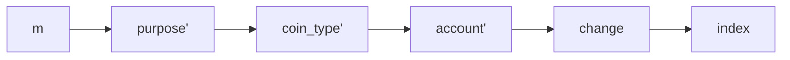
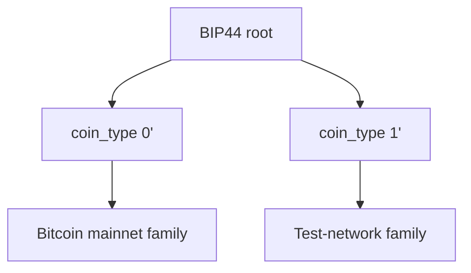
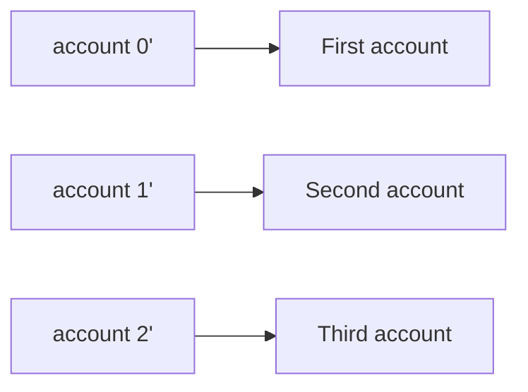
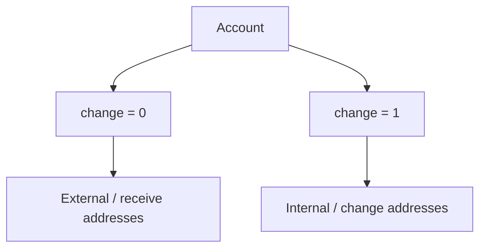
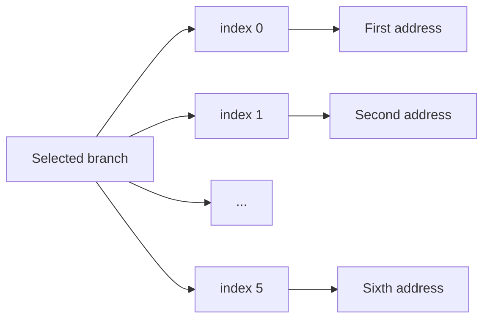
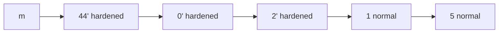
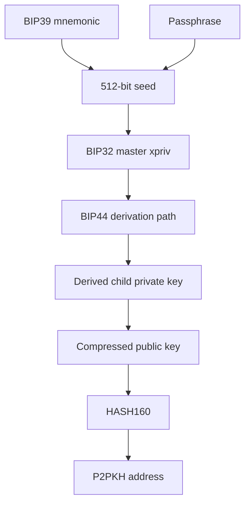
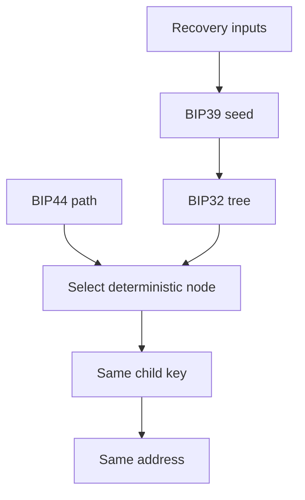

# Lab 09 — BIP44 path decoding

## Commands used

The public Lab 09 test suite was executed with:

```powershell
cargo test --test lab_09 -- --nocapture
```

The implementation under test is located at:

```text
src/labs/lab09_bip44.rs
```

Only the published disposable BIP39 classroom mnemonic was used:

```text
abandon abandon abandon abandon abandon abandon abandon abandon abandon abandon abandon about
```

No real wallet recovery material or production private keys were used.

The public tests validate:

* decoding all five BIP44 path levels;
* explaining zero-based account and address indexes;
* distinguishing receive and change branches;
* modifying only the final address index;
* deriving a deterministic disposable P2PKH address.

## Terminal output

### Decoded BIP44 path

The test path is:

```text
m/44'/0'/2'/1/5
```

It decodes to:

```text
purpose:   44
coin_type: 0
account:   2
change:    1
index:     5
```

Human-readable interpretation:

```text
Purpose 44:
BIP44 wallet structure

Coin type 0:
Bitcoin

Account 2:
third account

Change 1:
internal/change chain

Index 5:
sixth address
```

The indexes are zero-based, therefore:

```text
account 0 = first account
account 1 = second account
account 2 = third account

index 0 = first address
index 5 = sixth address
```

### Changed address index

The original path:

```text
m/44'/0'/2'/1/5
```

with its final index changed to `6` becomes:

```text
m/44'/0'/2'/1/6
```

Only the final address index changes.

The following fields remain unchanged:

```text
purpose:   44'
coin_type: 0'
account:   2'
change:    1
```

### Disposable BIP44 address

The public test derives:

```text
m/44'/1'/0'/0/0
```

using:

```text
Network:
Regtest

Passphrase:
(empty)
```

The resulting disposable P2PKH address is:

```text
mkpZhYtJu2r87Js3pDiWJDmPte2NRZ8bJV
```

This address belongs to the test/regtest P2PKH family and therefore begins with:

```text
m...
```

The public test accepts either:

```text
m...
```

or:

```text
n...
```

for this network family.

The derivation is deterministic:

```text
same mnemonic
+
same passphrase
+
same BIP44 path
+
same network
=
same address
```

A successful public test run should report:

```text
running 4 tests

test decodes_every_bip44_level ... ok
test explains_zero_based_account_and_chain ... ok
test changes_only_the_final_index ... ok
test derives_the_selected_bip44_address ... ok

test result: ok. 4 passed; 0 failed
```

## Evidence references

Evidence for Lab 09 consists of:

* `src/labs/lab09_bip44.rs` — implementation of BIP44 path decoding, description, index replacement, and P2PKH address derivation.
* `tests/lab_09.rs` — public tests validating the required BIP44 behavior.
* Terminal execution of:

```powershell
cargo test --test lab_09 -- --nocapture
```

* Decoded public path:

```text
m/44'/0'/2'/1/5

purpose   = 44
coin_type = 0
account   = 2
change    = 1
index     = 5
```

* Changed path:

```text
Original:
m/44'/0'/2'/1/5

New:
m/44'/0'/2'/1/6
```

* Disposable Regtest P2PKH derivation:

```text
Path:
m/44'/1'/0'/0/0

Address:
mkpZhYtJu2r87Js3pDiWJDmPte2NRZ8bJV
```

Only public disposable test material is recorded.

## Explanation

BIP32 provides a general hierarchical deterministic key tree, while BIP44 defines a standardized meaning for specific levels of that tree.

A BIP44 path has the structure:

```text
m / purpose' / coin_type' / account' / change / index
```

Conceptually:



For example:

```text
m/44'/0'/2'/1/5
```

contains five levels after the master key.

### Purpose

The first level is:

```text
44'
```

The value `44` identifies the BIP44 wallet convention.


The apostrophe means this child is derived using hardened derivation.

### Coin type

The second level identifies the cryptocurrency or network family.

In:

```text
m/44'/0'/2'/1/5
```

the coin type is:

```text
0'
```

which represents Bitcoin in the standard BIP44 namespace.

The test derivation uses:

```text
m/44'/1'/0'/0/0
```

where:

```text
1'
```

is the test-family coin type used for disposable test/regtest derivations.

Conceptually:



### Account

The third level separates independent wallet accounts.

For:

```text
account = 2
```

the human-readable interpretation is:

```text
third account
```

because BIP44 account numbers are zero-based.



The account level is hardened.

This creates a boundary between account branches in the HD wallet.

### Receive and change branches

The fourth level is called the change level.

BIP44 conventionally uses:

```text
0 = external / receiving chain
1 = internal / change chain
```



The external branch is normally used for addresses presented to other users for receiving payments.

The internal branch is commonly used for transaction change outputs.

For the test path:

```text
m/44'/0'/2'/1/5
```

the value:

```text
change = 1
```

therefore selects the change branch.

### Address index

The final component selects one address inside the chosen branch.

For:

```text
index = 5
```

the path selects the:

```text
sixth address
```

because the numbering starts at zero.



Changing:

```text
m/44'/0'/2'/1/5
```

to:

```text
m/44'/0'/2'/1/6
```

therefore selects the next address while preserving the same purpose, coin type, account, and branch.

### Hardened and normal levels

The apostrophes in:

```text
m/44'/0'/2'/1/5
```

identify hardened derivation steps.

The hierarchy is:

```text
44'  hardened
0'   hardened
2'   hardened
1    normal
5    normal
```



This follows directly from the BIP32 concepts demonstrated in Lab 08.

The account hierarchy uses hardened boundaries, while the receive/change branches and individual addresses use normal child derivation.

### From mnemonic to BIP44 address

The complete derivation performed in this lab is:



For the public test:

```text
m/44'/1'/0'/0/0
```

the hierarchy can be interpreted as:


The resulting disposable Regtest/test-family P2PKH address is:

```text
mkpZhYtJu2r87Js3pDiWJDmPte2NRZ8bJV
```

### Why deterministic paths matter

A hierarchical deterministic wallet does not need to store an unrelated private key for every address.

Instead:

```text
mnemonic
+
passphrase
+
derivation path
```

deterministically selects the same child key.



Therefore, if the same recovery inputs and the same path conventions are used again, the same address can be reproduced.

This is also why the path matters during wallet recovery: knowing only the mnemonic is not always sufficient to know which branches and address types a wallet originally used.

The key BIP44 structure demonstrated by this lab is:

```text
m / purpose' / coin_type' / account' / change / index

purpose
= wallet convention

coin_type
= asset/network namespace

account
= zero-based account branch

change
= 0 receive / 1 change

index
= zero-based address number
```

Only public disposable classroom recovery data is used in this submission.
