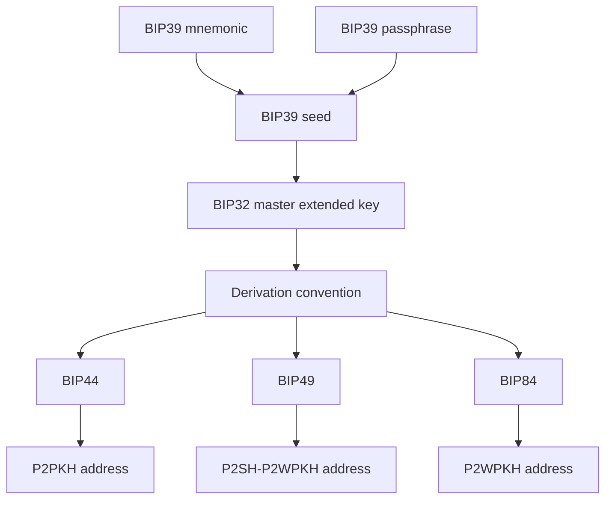
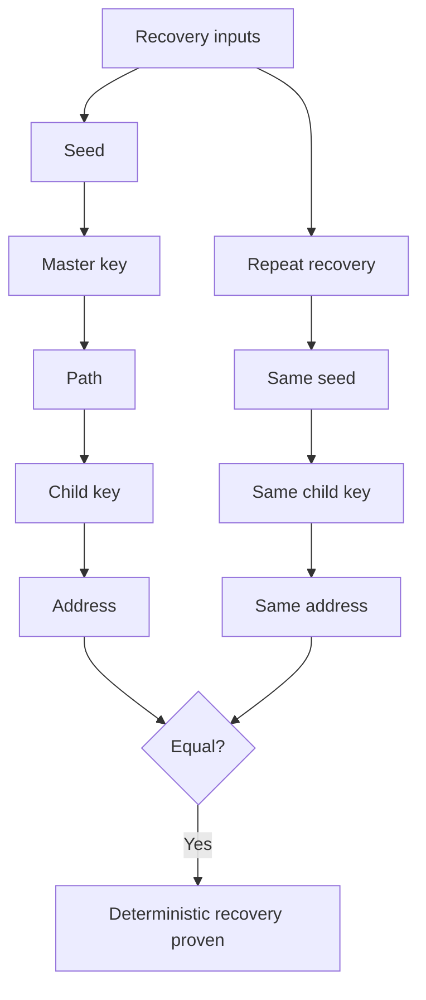
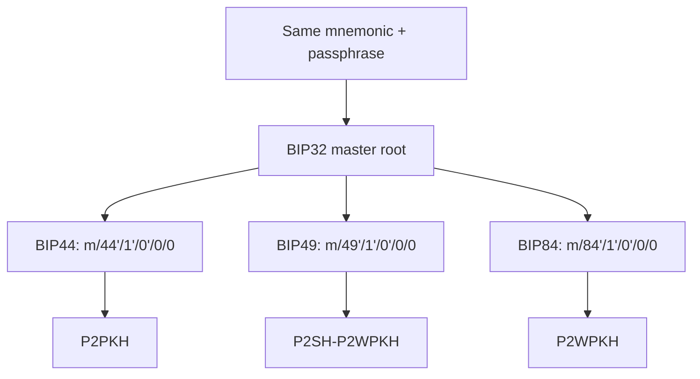
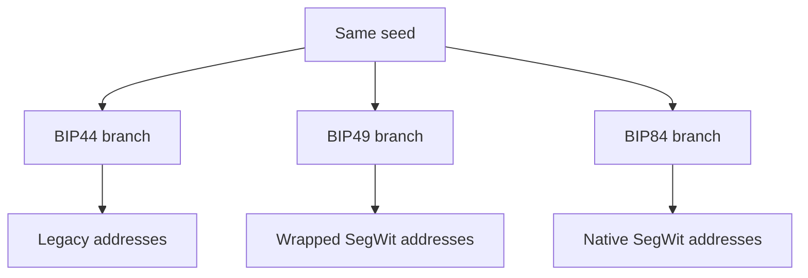
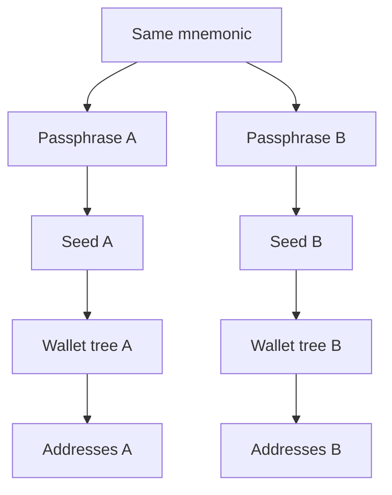
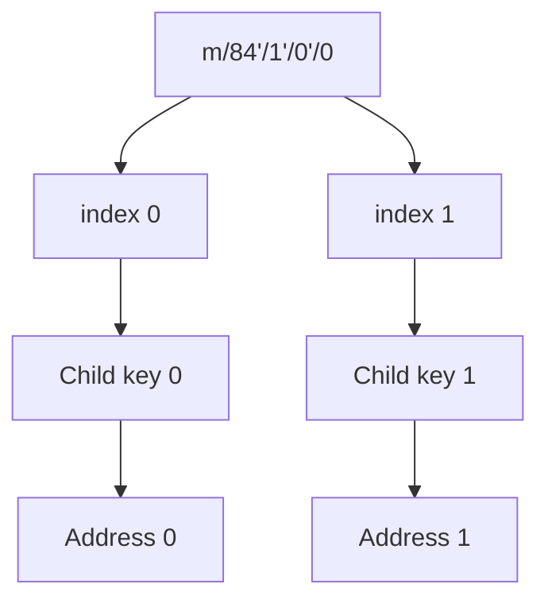
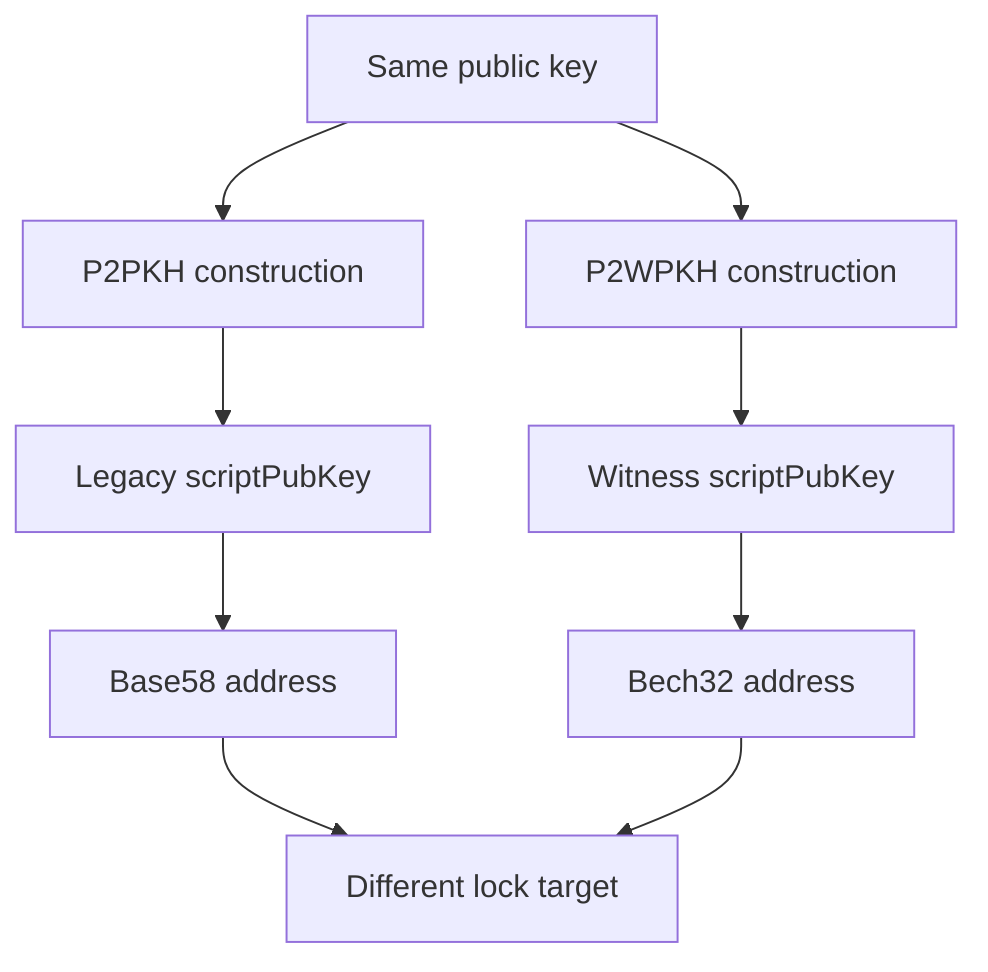
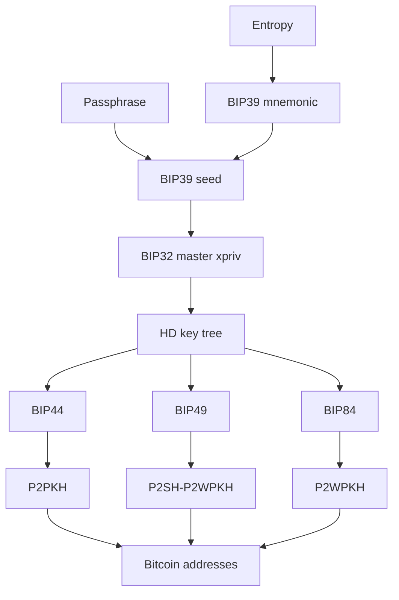

# Lab 10 — Deterministic recovery across address families

## Commands used

The public Lab 10 test suite was executed with:

```powershell
cargo test --test lab_10 -- --nocapture
```

The implementation under test is located at:

```text
src/labs/lab10_recovery.rs
```

Only the published classroom BIP39 test mnemonic was used:

```text
abandon abandon abandon abandon abandon abandon abandon abandon abandon abandon abandon about
```

No real wallet recovery words, private keys, xprivs, seeds, or production wallet information were used.

The public tests validate:

* derivation of BIP44 P2PKH addresses;
* derivation of BIP49 wrapped SegWit addresses;
* derivation of BIP84 native SegWit addresses;
* repeatability of deterministic recovery;
* address changes when only the final child index changes;
* different address encodings for different script families.

## Terminal output

### Address set at account 0, index 0

The same public mnemonic and empty passphrase were used to derive three address families on Regtest.

### BIP44 — P2PKH

Derivation path:

```text
m/44'/1'/0'/0/0
```

Purpose:

```text
44'
```

Script/address family:

```text
P2PKH
```

Disposable Regtest address:

```text
mkpZhYtJu2r87Js3pDiWJDmPte2NRZ8bJV
```

The address uses the expected test-network P2PKH prefix:

```text
m...
```

---

### BIP49 — P2SH-P2WPKH

Derivation path:

```text
m/49'/1'/0'/0/0
```

Purpose:

```text
49'
```

Script/address family:

```text
P2SH-wrapped P2WPKH
```

Disposable Regtest address:

```text
2Mww8dCYPUpKHofjgcXcBCEGmniw9CoaiD2
```

The address uses the expected test/regtest P2SH prefix:

```text
2...
```

---

### BIP84 — native P2WPKH

Derivation path:

```text
m/84'/1'/0'/0/0
```

Purpose:

```text
84'
```

Script/address family:

```text
native P2WPKH
```

Disposable Regtest address:

```text
bcrt1q6rz28mcfaxtmd6v789l9rrlrusdprr9pz3cppk
```

The address uses the expected Regtest native SegWit prefix:

```text
bcrt1q...
```

### Address-family summary

```text
BIP44
m/44'/1'/0'/0/0
P2PKH
mkpZhYtJu2r87Js3pDiWJDmPte2NRZ8bJV

BIP49
m/49'/1'/0'/0/0
P2SH-P2WPKH
2Mww8dCYPUpKHofjgcXcBCEGmniw9CoaiD2

BIP84
m/84'/1'/0'/0/0
P2WPKH
bcrt1q6rz28mcfaxtmd6v789l9rrlrusdprr9pz3cppk
```

### Repeatability test

The public test uses:

```text
Mnemonic:
public classroom mnemonic

Passphrase:
class

Path:
m/84'/1'/0'/0/0

Format:
P2WPKH

Network:
Regtest
```

The same derivation is executed twice.

Result:

```text
recovery_is_repeatable = true
```

Conceptually:

```text
same mnemonic
+
same passphrase
+
same path
+
same script family
+
same network
=
same address
```

### Changing only the final index

The test compares:

```text
m/84'/1'/0'/0/0
```

with:

```text
m/84'/1'/0'/0/1
```

For the empty-passphrase public test wallet, these select:

```text
Index 0:
bcrt1q6rz28mcfaxtmd6v789l9rrlrusdprr9pz3cppk

Index 1:
bcrt1qd7spv5q28348xl4myc8zmh983w5jx32cs707jh
```

Result:

```text
changing_index_changes_address = true
```

Everything except the final address index remains unchanged.

### Same path, different lock target

The public tests also derive the same child path:

```text
m/44'/1'/0'/0/0
```

using both:

```text
P2PKH
```

and:

```text
P2WPKH
```

The resulting addresses are different.

Therefore:

```text
same key derivation path
+
different script/address encoding
=
different Bitcoin address
```

A successful public test run should report:

```text
running 4 tests

test derives_three_regtest_address_families ... ok
test identical_recovery_inputs_repeat ... ok
test changing_only_the_index_changes_the_address ... ok
test format_selection_changes_the_lock_target ... ok

test result: ok. 4 passed; 0 failed
```

## Evidence references

Evidence for Lab 10 consists of:

* `src/labs/lab10_recovery.rs` — implementation of deterministic address derivation across BIP44, BIP49, and BIP84.
* `tests/lab_10.rs` — public tests validating address families, repeatability, index changes, and script-family selection.
* Terminal execution of:

```powershell
cargo test --test lab_10 -- --nocapture
```

* Disposable address set derived from public classroom data:

```text
BIP44 / P2PKH
m/44'/1'/0'/0/0
mkpZhYtJu2r87Js3pDiWJDmPte2NRZ8bJV

BIP49 / P2SH-P2WPKH
m/49'/1'/0'/0/0
2Mww8dCYPUpKHofjgcXcBCEGmniw9CoaiD2

BIP84 / P2WPKH
m/84'/1'/0'/0/0
bcrt1q6rz28mcfaxtmd6v789l9rrlrusdprr9pz3cppk
```

* Repeatability observation:

```text
identical recovery inputs
→ identical derived address

Result:
true
```

* Changed-index observation:

```text
m/84'/1'/0'/0/0
→ bcrt1q6rz28mcfaxtmd6v789l9rrlrusdprr9pz3cppk

m/84'/1'/0'/0/1
→ bcrt1qd7spv5q28348xl4myc8zmh983w5jx32cs707jh

Addresses differ:
true
```

All evidence uses public and disposable classroom test material.

## Explanation

Lab 10 demonstrates that Bitcoin wallet recovery is deterministic, but the mnemonic alone does not completely describe which addresses a wallet uses.

The full process is:



### Deterministic recovery

BIP39 and BIP32 are deterministic.

Given identical inputs:

```text
mnemonic
passphrase
network
derivation path
```

the same BIP32 child key will be reconstructed.

If the same script family is then used, the same Bitcoin address is reproduced.



This is why the public test expects:

```text
recovery_is_repeatable = true
```

### One recovery root, multiple address families

The same BIP39 recovery root can produce several wallet branches.

For this lab:



The important point is that all three branches start from the same recovery seed.

They differ because their derivation conventions select different child keys and different script families.

### BIP44

BIP44 uses purpose:

```text
44'
```

The path used in this lab is:

```text
m/44'/1'/0'/0/0
```

The resulting address family is:

```text
P2PKH
```

On Regtest/test networks, P2PKH addresses begin with:

```text
m...
```

or:

```text
n...
```

The disposable address produced here is:

```text
mkpZhYtJu2r87Js3pDiWJDmPte2NRZ8bJV
```

### BIP49

BIP49 uses purpose:

```text
49'
```

The path is:

```text
m/49'/1'/0'/0/0
```

This branch represents wrapped SegWit:

```text
P2SH-P2WPKH
```

Conceptually:


The disposable Regtest address is:

```text
2Mww8dCYPUpKHofjgcXcBCEGmniw9CoaiD2
```

### BIP84

BIP84 uses purpose:

```text
84'
```

The path is:

```text
m/84'/1'/0'/0/0
```

This produces native SegWit P2WPKH.


The disposable address is:

```text
bcrt1q6rz28mcfaxtmd6v789l9rrlrusdprr9pz3cppk
```

### Why the mnemonic is not enough by itself

A mnemonic produces a deterministic seed, but a wallet can derive many possible branches from that seed.

For example:

```text
m/44'/1'/0'/0/0
m/49'/1'/0'/0/0
m/84'/1'/0'/0/0
```

are all valid derivations from the same recovery root.



Therefore, recovering only the mnemonic but scanning the wrong derivation convention can make a wallet appear empty even though the private keys can still be deterministically reconstructed on another branch.

Wallet recovery therefore depends on:

```text
mnemonic
+
passphrase
+
derivation path convention
+
script/address family
+
network
```

### The passphrase is part of recovery

The BIP39 passphrase changes the seed itself.

Therefore:

```text
same mnemonic
+
different passphrase
=
different seed
=
different BIP32 tree
=
different addresses
```



This means that forgetting a BIP39 passphrase cannot be solved simply by possessing the mnemonic.

### Address index selection

Inside a receive branch, each final index selects a different deterministic child.

For example:

```text
m/84'/1'/0'/0/0
```

selects index `0`.

Changing only the last component:

```text
m/84'/1'/0'/0/1
```

selects index `1`.



The resulting addresses are:

```text
Index 0:
bcrt1q6rz28mcfaxtmd6v789l9rrlrusdprr9pz3cppk

Index 1:
bcrt1qd7spv5q28348xl4myc8zmh983w5jx32cs707jh
```

This proves that deterministic does not mean that the wallet has only one address.

Instead, it means that the same ordered tree of addresses can always be reconstructed from the same root and conventions.

### Key derivation and script encoding are separate

The tests also demonstrate that even if the same derivation path selects the same key material, encoding that key under different spending conditions produces different addresses.

For example:

```text
same child public key
```

can participate in:

```text
P2PKH
```

or:

```text
P2WPKH
```

but these represent different locking scripts.



Therefore:

```text
key identity
≠
script type
≠
address representation
```

### Complete Week 5 recovery model

The complete sequence covered by the later Week 5 labs can be summarized as:



The main conclusion of this lab is:

```text
A Bitcoin wallet is reproducible because its key hierarchy is deterministic.

But correct recovery requires both the original recovery inputs
and knowledge of the derivation/script conventions used by the wallet.
```

All examples in this submission use only the published classroom mnemonic and disposable Regtest addresses.
