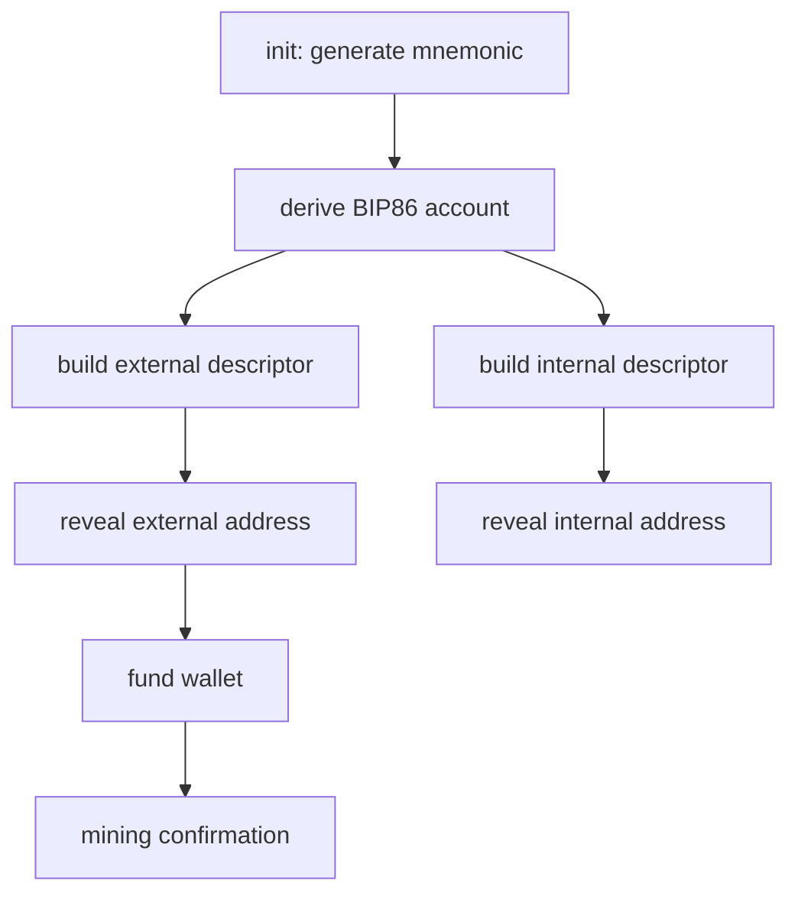
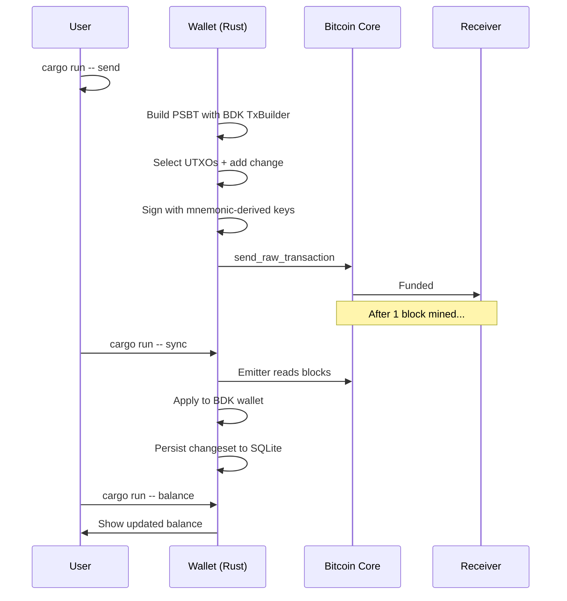

# BDK Regtest Wallet – Week 6

> A lightweight, descriptor-based Bitcoin wallet for local regtest development.

## What is this?

This wallet lets you:

- **Generate keys** from a fresh BIP39 seed 
- **Derive addresses** on two keychains: external (receiving) and internal (change) 
- **Track balance and UTXOs** by syncing with Bitcoin Core 
- **Persist all state** in SQLite so you never lose track 
- **Send transactions** — build, sign, broadcast 
- **Talk to Bitcoin Core** over RPC for chain data and broadcasting 

It's built for **regtest** (deterministic local testing), using **BDK 3.x**, **rust-bitcoin**, and **bitcoincore-rpc**. No testnet faucets required.

---

## Who is this for?

Anyone building on Bitcoin who wants a hands-on wallet implementation using modern Rust crates. This is **not production-grade key management** — the `.env` stores your seed in plaintext. Use it for learning and testing only.

---

## What crates are used and why?

| Crate        | Purpose                                                                 |
|--------------|-------------------------------------------------------------------------|
| `bdk_wallet` | Descriptors, keychains, address derivation, coin selection, signing   |
| `bdk_sqlite` | Async persistence of wallet state in SQLite                          |
| `bdk_bitcoind_rpc` | Emits blocks and mempool data from Bitcoin Core               |
| `bitcoincore-rpc` | Authenticated RPC connection + raw transaction broadcast     |
| `bitcoin`    | Network-aware addresses, BIP32 derivation, types                    |
| `clap`       | Command-line interface CLI                                          |
| `dotenvy`    | Loads `.env` configuration                                            |
| `tokio`      | Async runtime for SQLite operations                                   |

---

## How it works

The wallet uses **BIP86 Taproot** descriptors with separate keychains for receiving and change.

### Descriptor structure

```text
External (receiving): tr([fingerprint/86'/1'/0']tpub.../0/*)
Internal (change):     tr([fingerprint/86'/1'/0']tpub.../1/*)
```

The `external` keychain is what you hand out for receiving funds. The `internal` keychain is used for change outputs. This separation is critical for privacy.

---

## Prerequisites

### Install Bitcoin Core

Download from [bitcoin.org](https://bitcoin.org/en/download)

### Configure regtest

Create `bitcoin.conf` with:

```ini
regtest=1
server=1
rpcuser=bitcoin
rpcpassword=bitcoin
txindex=1
fallbackfee=0.0001
```

### Start the node

```powershell
& "C:\Program Files\Bitcoin\daemon\bitcoind.exe" "-regtest"
```

### Create a miner wallet

```powershell
& "C:\Program Files\Bitcoin\daemon\bitcoin-cli.exe" "-regtest" "createwallet" "miner"
```

### Fund the miner wallet

Mine 101 blocks to activate spendable balance:

```powershell
$miner = & "C:\Program Files\Bitcoin\daemon\bitcoin-cli.exe" "-regtest" "-rpcwallet=miner" "getnewaddress"
& "C:\Program Files\Bitcoin\daemon\bitcoin-cli.exe" "-regtest" "-rpcwallet=miner" "generatetoaddress" "101" $miner
```

---

## Getting started

```powershell
Set-Location "C:\Users\LENOVO\Desktop\rust-bitcoin\rust-for-bitcoin-2.0\rfb_labs_week_6"
```

### Initialize the wallet

Creates `.env` with a new mnemonic and initializes `wallet.sqlite`:

```powershell
cargo run -- init
```

You'll see output like:

```text
Generated mnemonic and wrote it to .env. Back it up securely.
Initialized regtest Taproot wallet in wallet.sqlite
External descriptor: tr([.../86'/1'/0].../0/*)#...
Internal descriptor: tr([.../86'/1'/0].../1/*)#...
```

### Address flow



### Generate addresses

External (receiving):

```powershell
cargo run -- address external
```

Internal (change):

```powershell
cargo run -- address internal
```

### Sync with Bitcoin Core

```powershell
cargo run -- sync
```

### Check your balance

```powershell
cargo run -- balance
```

### List UTXOs

```powershell
cargo run -- utxos
```

### Send funds

```powershell
cargo run -- send --to <RECEIVING_ADDRESS> --amount-sats 50000 --fee-rate 2
```

---

## Sync and transaction flow



---

## Live validation record 

Tested against Bitcoin Core **regtest** on **5 September 2026**:

1. **Generated wallet and synced** — 102 blocks processed
2. **Received funds** — 100,000,000 sats confirmed
3. **Signed and broadcast transaction** — `ca6f6dbee075af770058e19a8a33940c2e567e6554f8cc367fda9782c3827635`
4. **Change handled by internal keychain** — 99,949,691 sats returned to Internal
5. **Transaction confirmed** — 1 confirmation in block `3fd650dcd55ec3fab0db59735883704adc2c9d745e6c00dbf950acad018d205c`
6. **Additional funding** — 50,000,000 sats sent from miner, balance updated to `149,999,691` sats after resync
7. **Persistence verified** — State survived process restarts

Before:

```text
available=99999691 sats
```

After additional funding + sync:

```text
available=149999691 sats
```

UTXO set:

```text
ca6f6dbee075af770058e19a8a33940c2e567e6554f8cc367fda9782c3827635:0 value=50000 sats keychain=External
901fd89efc237d65fe8f992dd12f3cdc7b7d3f68163aa18d5fff8eb33d350331:0 value=50000000 sats keychain=External
ca6f6dbee075af770058e19a8a33940c2e567e6554f8cc367fda9782c3827635:1 value=99949691 sats keychain=Internal
```

---

## Project structure

```text
rfb_labs_week_6/
├── Cargo.toml          # Dependencies
├── Readme.md           # You are here 📄
├── .gitignore          # Excludes .env and sqlite
├── .env.example        # Config template
├── src/
│   └── main.rs         # Wallet CLI implementation
├── wallet.sqlite       # Generated on init (ignored)
└── .env                # Generated on init (ignored)
```

---

## Limitations and future work

- **Educational use only** — `.env` stores seed in plaintext
- **No encrypted wallet** — consider encrypting `WALLET_MNEMONIC` at rest
- **No hardware signing** — integrates easily for future extension
- **Single network** — currently limited to `regtest` (testnet is a config change away)
- **Basic error handling** — panics are avoided, but detailed UX errors could improve

---

## License

Educational project. Not intended for production use.